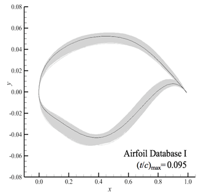
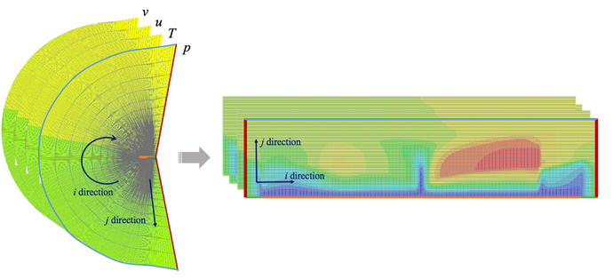
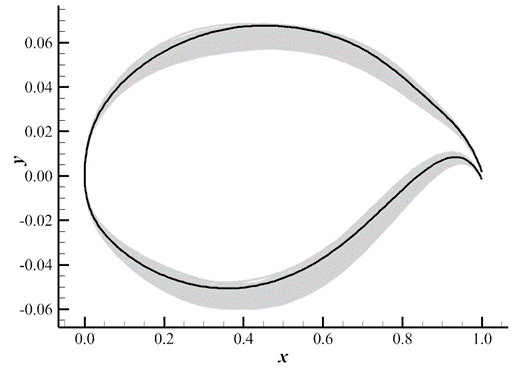
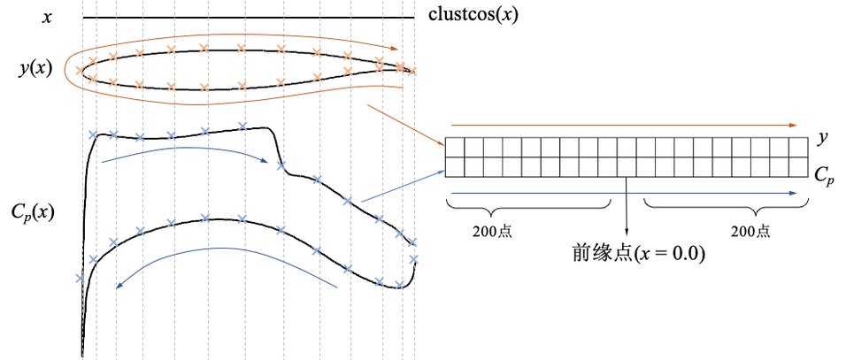
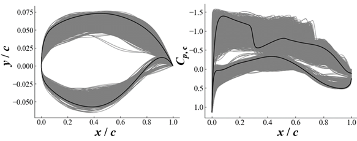

[TOC]

# Datasets for supercritical airfoils

The dataset below are generated by Runze Li in Tsinghua University. Later Yunjia Yang rearranged them to dataset (under the format introduced in below section). They are available under reasonable requests. Please contact Yunjia Yang (yyj980401@126.com) for the datasets.

Here is a summary for the datasets below:

| Dataset | $(t/c)_{\max}$ | $Ma_{\infty}$ | $C_L$ | $AoA$(deg.) | $N_{\mathrm{Airfoils}}$ | $N_{\mathrm{flowfileds}}$ | Comment |
|-|-|-|-|-|-|-|-|
|A-1| 0.095 | 0.76 | `linspace(0.6, 1.0, 0.04)` | / | 1498 | 16478 |
|A-2| 0.113-0.124| 0.73 | / | -3.0 ~ 4.5 | 501 | 27514 | O-type grid
|A-3-t1| `linspace(0.09, 0.13, 0.01)` | 0.76 | `linspace(0.6, 1.0, 0.04)` | / | 1414 | 15554 | test dataset for A-1
|A-3-1 (n3) | `linspace(0.09, 0.13, 0.01)` | `linspace(0.71, 0.76, 0.01)` | / | -3.0-5.0 | 1217 | 25607 | for buffet onset |
|A-3-2 (n4) | `linspace(0.09, 0.13, 0.01)` | 0.65-0.80 | `linspace(0.6, 0.9, 0.01)` | /| | 1266 | 17386 | for drag divergence
|A-3-3 (n5) | 0.085-0.135 | 0.705-0.765 | 0.0-1.0 | / | 1341 | 16031 |
|


## A-1. Supercritical Airfoil Flowfield Dataset

This dataset contains 1498 supercritical airfoils with same maximum thickness. For each airfoil, the flowfield under 11 lift coefficients (from 0.6 to 1.0) and Ma = 0.76 are obtained.

The dataset has been used in:

- Yunjia Yang, Runze Li, Yufei Zhang, and Haixin Chen*. 2022. “Flowfield Prediction of Airfoil Off-Design Conditions Based on a Modified Variational Autoencoder.” AIAA Journal 60 (10): 5805–20. https://doi.org/10.2514/1.J061972.

### Sampling

- Maximum relative thickness = 0.095 
- Sampled with the output space sampling (OSS) method in the space of 14 CST parameters. The purpose of sampling is to obtain airfoil geometries with abundant upper-surface pressure profile 
- Constrianed with Other engineering constraints
    - leading-edge radius is larger than 0.007
    - the cruise point drag coefficient does not exceed 0.1 
- A total of 1498 samples are obtained in the sampling process




**Citation for sampling method**

```text
Runze, LI, Yufei Zhang, and Haixin Chen*. 2022. "Pressure distribution feature-oriented sampling for statistical analysis of supercritical airfoil aerodynamics". Chinese Journal of Aeronautics, 35 (4): 14.
```

### Grid 

- Structured C-type grid solved with elliptic equation to ensure grid orthogonality
- Grid size is 381×81 in the circumferential direction (i-direction) and wall-normal direction (j-direction). 
- The grid contains 300 cells on the airfoil surface. The far-field location is 80 chords away from the airfoil. The height of the first mesh layer is 2.7e-6 chord.

### CFD

- Computed using the Reynolds Average Navier–Stokes (RANS) solver CFL3D. 
    - finite volume method
    - MUSCL scheme, ROE scheme
    - Gauss-Seidel algorithm
- Turbulance model: shear stress transport (SST) model

### Data format

#### data

The infomation of flowfield data are below:

| array size | (16478, 6, 331, 75) |
|-|-|
| channel name | `x`,`y`, `p`, `T`, `u`, `v` *|
| flowfield size | 331 x 75 **|

\* all flowfield variables are NON-DIMENSIONAL with freestream condition (in CFL3D.prt way); values are on mesh points.

$$
p = \frac{\tilde p}{\tilde p_\infty}, T = \frac{\tilde T}{\tilde T_\infty}, u = \frac{\tilde u}{\tilde u_\infty}, v = \frac{\tilde v}{\tilde v_\infty}, 
$$

where ~ stands for dimensional values

\*\* The index of the flowfield is shown below



#### index 

The infomation of index data are below:

| array size | (16478, 10) |
|-|-|
| channel 0  |  airfoil index  |
| channel 1  |  condition index  |
| channel 2  |  ref index for the airfoil|
| channel 3  |  aoa |
| channel 4  |  ref aoa  |
| channel 5  |    ref ma  |
| channel 6  |  ref cl  |
| channel 7  |  cl  |
| channel 8  |  cd  |
| channel 9  |  running idx |

## A-2. Supercritical Airfoil Cp Dataset

This dataset contains 501 supercritical airfoils with maximum thickness from 0.113 to 0.124. For each airfoil, the flowfield under 51 - 58 angle of attacks and Ma = 0.73 are obtained.

The dataset has been used in:

- Yang, Yunjia, Runze Li, Yufei Zhang, and Haixin Chen. 2024. “Buffet Onset Optimization for Supercritical Airfoils with Prior-Based Pressure Profile Prediction Model.” In AIAA SCITECH 2024 Forum. Orlando, FL: American Institute of Aeronautics and Astronautics. https://doi.org/10.2514/6.2024-1227.

### Sampling

- Maximum relative thickness in 0.113 to 0.124
- Disturbance of the baseline airfoil (index = 0)



### Grid 

- Structured O-type grid
- Grid size is 417×193 in the circumferential direction (i-direction) and wall-normal direction (j-direction). 
- The grid contains 385 cells on the airfoil surface, 33 on tail (this part are not included in dataset), 193 on wall-normal direction.

### CFD

Same to A-1

### Data format

#### data
The infomation of flowfield data are below:

| array size | (27514, 2, 401) |
|-|-|
| channel name | `y`, `Cp` *|
| flowfield size | 401 **|

\* all flowfield variables are NON-DIMENSIONAL with freestream condition (in CFL3D's way); values are on mesh points.

$$
C_p = \frac{p - p_\infty}{0.5\rho V_\infty^2}
$$

\*\* The flowfield variable values are interpolated to the clustcos function as follow.

$$
x_i = \frac{\cos a_0\pi - \cos\left( a_0 (1-k_i)+a_1 k_i\right)\pi}{\cos a_0\pi - cos a_1\pi},\quad k_i = \frac{i}{n-1}
$$



#### index

The infomation of index data are below:

| array size | (27514, 9) |
|-|-|
| channel 0  |  airfoil index  |
| channel 1  |  condition index  |
| channel 2  |  ref index for the airfoil|
| channel 3  |  aoa |
| channel 4  |  ref aoa  |
| channel 5  |  ref cl  |
| channel 6  |  cl  |
| channel 7  |  cd  |
| channel 8  |  buffet index for the airfoil |

## A-3. Supercritical Airfoil Cp-Cf Dataset

This dataset contains 1217 supercritical airfoils with much board geometry parameters and operating conditions than the above two dataset. 

The dataset has been used in:

- Yang, Yunjia, Runze Li, Yufei Zhang, and Haixin Chen. 2024. “Fast Buffet-Onset Prediction and Optimization Method Based on Pretrained Flowfield Prediction Model.” AIAA Journal 62 (8): 1–17. https://doi.org/10.2514/1.J063634.


### Sampling

- The operating condition of the each airfoil is first decided, and the OSS method is used to obtain the airfoil geometry for various pressure distribution under the operating conditions.
- The range of the operating conditions and airfoil maximum relative thickness is below:
    |variable|upper|lower|
    |-|-|-|
    |maximum relative thickness|	0.09|0.13|
    |cruise freestream Mach number|	0.71|	0.76
    |cruise lift coefficient|	0.60 |0.90|
- For each airfoil, flowfield under 16 - 23 angles of attack are calculated



### Grid 

- Structured C-type grid solved with elliptic equation to ensure grid orthogonality
- Grid size is 381×81 in the circumferential direction (i-direction) and wall-normal direction (j-direction). 
- The grid contains 300 cells on the airfoil surface. The far-field location is 80 chords away from the airfoil. 

### CFD

Same to A-1

### Data format

#### data
The infomation of flowfield data are below:

| array size | (25607, 3, 401) |
|-|-|
| channel name | `y`, `Cp`, `Cf` *|
| flowfield size | 401 **|

\* \*\* Same to A-2.

#### index

The infomation of index data are below:

| array size | (25607, 13) |
|-|-|
| channel 0  |  airfoil index  |
| channel 1  |  condition index  |
| channel 2  |  ref index for the airfoil|
| channel 3  |  aoa |
| channel 4  |  ref aoa  |
| channel 5  |  ref ma  |
| channel 6  |  ref cl  |
| channel 7  |  buffet aoa (estimated)  |
| channel 8  |  sepearation aoa  |
| channel 9  |  cl  |
| channel 10  |  cd  |
| channel 11  |  running idx |
| channel 12  |  tmax |