[TOC]

# Model details


## Encoder & Decoder

There are several options of the Encoder & Decoder according to the flowfield being dealt with. They are implemented in `base_model.py` and with the framework of `torch.nn.Module`.

When using, the encoder and decoder should be defined explicitly before defining an `AEOperator`. For example:

```python
from flowvae.base_model import convEncoder_Unet, convDecoder_Unet

_encoder = convEncoder_Unet(in_channels=2, last_size=[5], hidden_dims=[64, 128, 256])
_decoder = convDecoder_Unet(out_channels=1, last_size=[5], hidden_dims=[256, 128, 64, 64], sizes = (24, 100, 401), encoder_hidden_dims=[256, 128, 64, 2])
```
The table below shows the available encoder and decoder.

| Type | Encoder | Decoder | 
|--|--|--|
| base class| `Encoder` | `Decoder` | 
| dense connected | `mlpEncoder` | `mlpDecoder` | 
| convolution (1D/2D) | `convEncoder` | `convDecoder` | 
| Unet convolution (1D/2D) | `convEncoder_Unet` | `convDecoder_Unet` | 
| ResNet | `Resnet18Encoder` | `Resnet18Decoder` |  

### Densely connected network

The most simple network for encoder and decoder. It consists of several dense connected hidden layers between the input and output. 

> **Remark:** The flowfield has spacial correlations. The densely connected network ignores such correlations because it takes the adjusted points in flowfields/profiles separately. Therefore, it is recommended to use convolutional networks to capture the correlations and reduce the size of trainable parameters.

#### `mlpEncoder`

The encoder is defined by:

```python
_encoder = mlpEncoder(in_channels=802, hidden_dims=[256, 128, 64])
```

- `hidden_dims`: (`List` of `int`)
The dimensions of each hidden layer are defined with the argument `hidden_dims`. The length of the `hidden_dims` is the amount of the hidden dimension.

- `in_channels`: (`int`)
The input dimension of the first hidden layer. No matter the dimension of the input prior flowfield (1D or 2D), it will be flattened to one dimension before input to the encoder, so the `in_channels` for the `mlpEncoder` should be the flatten one. 

#### `mlpDecoder`

The encoder and decoder are defined by:

```python
_decoder = mlpDecoder(in_channels=12, out_sizes=[401], hidden_dims=[64, 128, 256])
```

- `hidden_dims`: (`List` of `int`)
The dimensions of each hidden layer are defined with the arguments `hidden_dims`. The length of the `hidden_dims` is the amount of the hidden dimension.

- `in_channels`: (`int`)
The input dimension of the first hidden layer. It equals the latent dimension for the `mlpDecoder`. 

- `out_sizes`: (`List` of `int`)
The original size of the decoder's output. The decoder's output is resized to it in order to match the input size.

### Convolution network (1D or 2D)

One-dimensional convolution (1D conv) and two-dimensional convolution neural networks are promising solutions when dealing with 1D profiles (i.e., the pressure profiles on the airfoil) and 2D flowfields. They work mostly the same and can be found in every deep neural network textbook. The input to the 1D / 2D CNN can also have several channels, where each channel represents a flow variable (i.e., p, T, u, v).

#### `convEncoder`

The encoder consists of several encoder blocks. Each of the blocks contains a 1D / 2D convolutional layer (`nn.Conv1d` or `nn.Conv2d`), an activation layer (For default, we use the `nn.LeakyReLU`. It can be changed by assigning `basic_layers['actv'] = nn.ReLU`). 

The following figure shows the sketch of a 1D convolutional encoder. The 2D convolutional encoder is mostly the same, except that the feature maps are two-dimensional.


For each block, several hyper-parameters are needed, they are:
- channel size (`hidden_dims[i]`)
- kernel size (`kernel_sizes[i]`), stride (`strides[i]`), and padding (`paddings[i]`). For 1D, they are `int`; for 2D, `int` means they are the same for height and width direction, `tuple` means they are different.
- if there is an average pool layer, additional pool kernel size (`pool_kernels[i]`) and pool stride (`pool_strides[i]`) are needed.

The amount of blocks is given by the length of `hidden_dims`, and the dimensions of each hidden feature map is $B_i \times C_i \times H_i (\times W_i)$, where:
- $B_i$ is the size of the mini-batch
- $C_i$ is the channel size, given by the argument `hidden_dim[i]`
- $H_i (\times W_i)$ is the size of the feature map. It can be 1D or 2D. They are given by the parameters of the convolution kernel as follows:
$$H_i = \frac{H_{i-1} - k + 2 p}{s} + 1$$
$$W_i = \frac{W_{i-1} - k + 2 p}{s} + 1$$
where $k$ is the kernal size (`kernel_sizes[i]`), $s$ is the stride (`strides[i]`), and $p$ is the padding (`paddings[i]`).

If necessary, there can also be pooling layers in every or some of the blocks. The default type of the pooling layer is the average pool layer (`nn.AvgPool1d` or `nn.AvgPool2d`). (It can also be changed by assigning `basic_layers['pool'] = nn.MaxPool1d` or `basic_layers['pool'] = nn.MaxPool2d`)

The feature maps after the pooling layers can be derived by

$$H_{i'} =  \frac{H_{i} - k_p + 2 p_p}{s_p} + 1$$

Also if necessary, there can be batch normalization layers in every block. This can be done by assigning `basic_layers['bn'] = nn.BatchNorm1d` or `basic_layers['pool'] = nn.BatchNorm2d`. Here we code to put the batch normalization layers between the convolutional layers and the activation layers. Some research shows that locating the BN layers after the activation layers may lead to better performances, but we didn't find too many benefits.


**Arguments**

The encoder is defined by:

```python
_encoder = convEncoder(in_channels=2, last_size=[5], hidden_dims=[64, 128, 256], dimension=1)
```

- `in_channels`: (`int`)
    
    The size of channels of the profiles input to the encoder. Each channel can represent a flow variable (i.e., x, y, p, T, u, v)

- `last_size`: (`List` of `int`)
    
    The size of the feature map that is closest to the latent variables (for the encoder is the last feature map). Notice that the list does not contain the channel size.

- `hidden_dims`: (`List` of `int`)
    
    The channel size of the feature maps. The length of the `hidden_dims` determines the number of encoder blocks.

- `kernel_sizes`[**Default:** `3` for each block]: (`List` of `int`)
    
    The kernel sizes of each block. (see above)

- `strides` [**Default:** `2` for each block]: (`List` of `int`)
    
    The strides of each block. (see above)

- `pool_kernels` [**Default:** `3` for each block]: (`List` of `int`)
    
    The kernel sizes of the average pool layer of each block. (see above) **Remark:** If `pool_kernels[i] <= 0`, there will not be the average pool layer for block i.

- `pool_strides` [**Default:** `2` for each block]: (`List` of `int`)
    
    The strides of the average pool layer of each block. (see above)

- `dimension` [**Default:** `1`]: (`int`)
    
    The dimension of input and output feature maps. If 1D, the convolution, batch normalization, and pooling layers are all 1D. For 2D they are 2D.

- `basic_layers` [**Default:** see below]: (`Dict`)
    
    Basic layers to construct the encoder. The table below shows the fundamental layers and their default values. If onewantst to change the default one, the value for the corresponding key should be input to the encoder with the `Class` object.

    |key|1D|2D|
    |--|--|--|
    |`'conv'`|`nn.Conv1d`|`nn.Conv2d`|
    |`'actv'`|`nn.LeakyReLU`|`nn.LeakyReLU`|
    |`'pool'`|`nn.AvgPool1d`|`nn.AvgPool2d`|
    |`'bn'`|`None`|`None`|

#### `convDecoder`

The decoder also consists of several blocks. Each of the blocks realizes upscaling with three layers. First, a linear (for 1D) or bilinear (for 2D) interpolation layer (`F.interpolate`) expands the feature map to a given size `sizes[i]`. 

Then, a 1D / 2D convolutional layer is applied to modify the interpolation results. The size of the feature map is maintained the same for the convolutional layer, so the stride of the convolution kernel is 1, and the padding is given by $p = (k - 1) / 2$, where $k$ should be an odd number.

The last is the activation layer. Like the encoder, the default is an `nn.LeakyReLU` layer, and can be changed by assigning `basic_layers['actv']`. The batch normalization layer is also available if needed, by assigning `basic_layers['bn']`.

The upscaling process can also be done with `nn.ConvTranspose2d` for example, but they are not implemented in the FloGen.

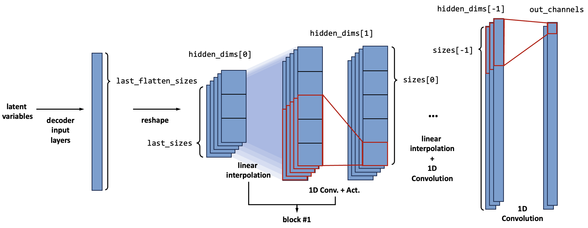

For each block, the channel size ( $C$ ) is given by `hidden_dims[i]`. The feature map ( $H (\times W)$ ) size is explicitly given by argument `sizes[i]`. For 1D cases, the `size[i]` should be an `int`, and for 2D cases, the `size[i]` should be a `List` containing two `int` (for $H$ and $W$).

**Arguments**

The decoder is defined by:

```python
_decoder = convDecoder(out_channels=1, last_size=[5], hidden_dims=[256, 512, 256, 128], sizes = [24, 100, 401], dimension=1)
```

- `out_channels`: (`int`)
    
    The size of channels of the decoder's output. It is not always the same as `in_channels`, because usually, we input the geometry channels as well as the flow variables to the encoder, but only want the decoder to reconstruct the flow variables.

- `last_size`: (`List` of `int`)
    
    The size of the feature map that is closest to the latent variables (for the decoder is the size input to the first decoder block). Notice that the list does not contain the channel size.

- `hidden_dims`: (`List` of `int`)
    
    The channel size of the feature maps. The length of the `hidden_dims` determines the number of decoder blocks.

- `sizes`: (`List` of `int`)
    
    The sizes of each feature map. (see above)

- `basic_layers` [**Default:** see below]: (`Dict`)
    
    Basic layers to construct the decoder. The table below shows the fundamental layers and their default values. If onewantst to change the default one, the value for the corresponding key should be input to the encoder with the `Class` object.

    |key|1D|2D|
    |--|--|--|
    |`'conv'`|`nn.Conv1d`|`nn.Conv2d`|
    |`'actv'`|`nn.LeakyReLU`|`nn.LeakyReLU`|
    |`'deconv'`|`base_model.IntpConv1d`|`base_model.IntpConv2d`|
    |`'bn'`|`None`|`None`|

### Convolutional U-Net (1D or 2D)

#### `convEncoder_Unet` & `convDecoder_Unet`

U-Net is a new model framework based on the Encoder-Decoder network for better model performances. The major consideration of the U-Net is to introduce the feature maps along the encoder to the corresponding decoder part. [Ref. Ronneberger (2015)]

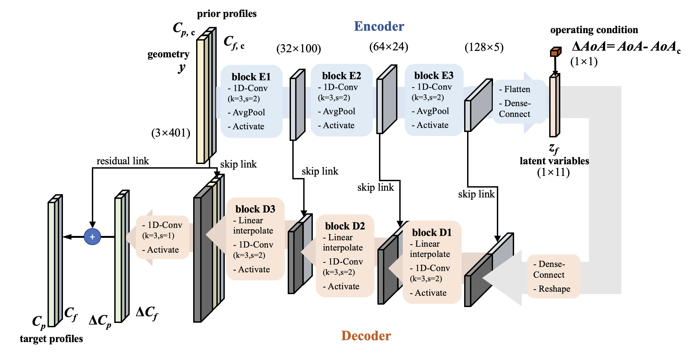

The U-Net improves model prediction performances in a way like the ResNet: introducing direct identical links (skip connection) to avoid gradient diminishing. Meanwhile, it won't increase the parameter size of the model, and will only raise a little training time cost. It is recommended to use U-Net version 1D-conv network by default.

The U-Net in FloGen is implemented with separate classes `convEncoder_Unet` and `convDecoder_Unet`. They inherit the vanilla `convEncoder` and `convDecoder`. 

The encoder and decoder are defined by:

```python
_encoder = convEncoder_Unet(in_channels=2, last_size=[5], hidden_dims=[64, 128, 256], dimension=1)
_decoder = convDecoder_Unet(out_channels=1, last_size=[5], hidden_dims=[256, 128, 64, 64],sizes = [24, 100, 401], dimension=1, encoder_hidden_dims=[256, 128, 64, 2]) 
```

The arguments of the U-Net version are mostly the same as the vanilla one, while there is one extra argument for the `convDecoder_Unet`:

- `encoder_hidden_dims` [Only `convDecoder_Unet`]: (`List` of `int`)
The channel dimension of the encoder's hidden layers. It should be a list of "reverse of the encoder's `hidden_dims`" and "encoder's `in_channel`".

### ResNet

ResNet is a popular CV backbone network [Ref. He (2016)]. It is simple, but its performance is outstanding. It improves model predicting performances by adding skip connections (shortcuts) between layers to avoid gradient diminishing. Here, the ResNet is invoked to construct the encoder and decoder.

#### Residual block

The minimum unit of the ResNet is **Residual Block (RB)** which implements the skip connection. Its structure is depicted in the following figure.

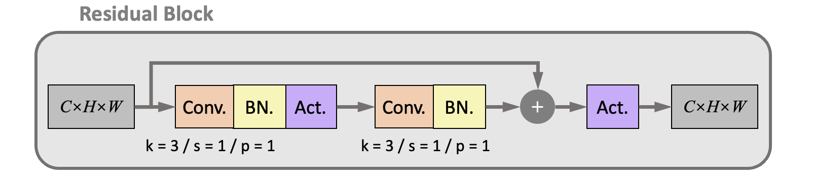

There are two connection paths between the input and output feature maps:

The lower is the **main path**, consisting of two groups of the 2D convolutional layers. The kernel parameters of the convolutional layers are fixed to kernel size ( $k$ ) = 3, stride ( $s$ ) = 1, and padding( $p$ ) = 1. Therefore, the size of the output feature map is the same as the input. The upper is a **shortcut path** which directly connects the input and output feature maps, ensuring the propagation of the value and gradients.

There are also batch normalization layers and activation layers after each convolutional layer. Due to the BN layer, the `bias` is shut down in the convolutional layer. 

> **Pre-activation strategy:** Research shows that the BN layer and activation can be moved to in front of the convolutional layer to improve performances. It leads to the *pre-activation* version of the residual block, as shown in the figure.
> 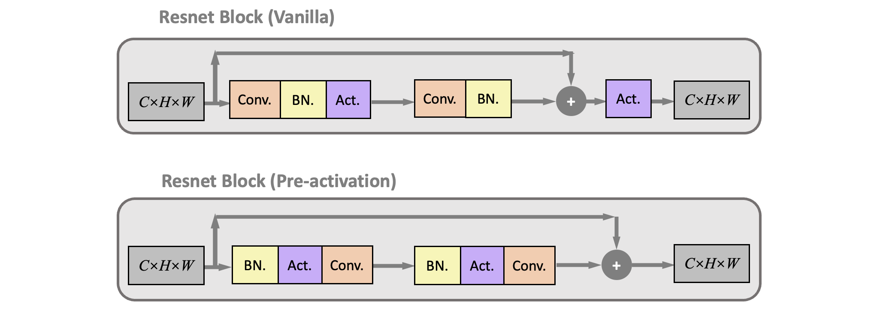
> The FloGen supports the pre-activation version by setting the argument `preactive = True`. Yet, it didn't show much improvement in the test cases.

#### Residual block for down-sampling and up-sampling

The residual blocks also need to up-sample and down-sample the feature maps. This is done by the **down-sampling residual block (RBDS)** and **up-sampling residual block (RBUS)**, whose structures are shown in the following figure:

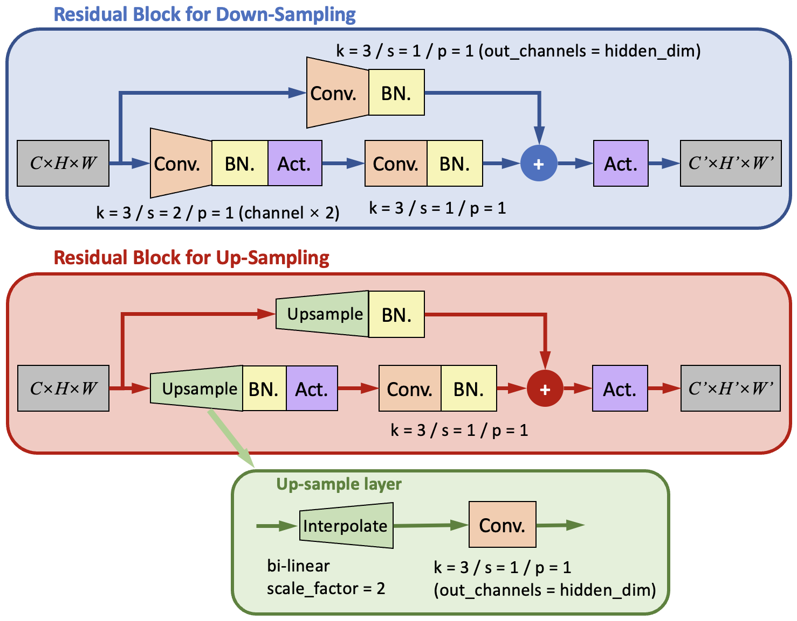

There are still two paths in the RBDS and RBUS. In order to change the size of the output feature maps, the kernel parameters for the first convolutional layer are modified. 

For the RBDS, it is modified to a kernel with kernel size ( $k$ ) = 3, <u>stride ( $s$ ) = 2 </u>, and padding( $p$ ) = 1. Meanwhile, the number of channels is increased to the given `hidden_dims[i]` to maintain the conservation of information flux.

For RBUS, the first convolutional layer is replaced with an up-sample layer that is similar to what we used in the `convDecoder`. It contains a bilinear (for 2D) interpolation layer (`F.interpolate`) with `scale_factor = 2` to double the height and width of the feature map; and a 2D convolutional layer with kernel size = 3, stride = 1, and padding = 1. The convolution layer also reduces the number of channels to the given `hidden_dims[i]`.

> **Interpolation layer:**  The interpolate layer is implemented with the class `IntpConv`. It has one-dimensional version `IntpConv1d` and two-dimensional version `IntpConv2d`. They all use `F.interpolate` to up-sampling and down-sampling the feature map into the given sizes. The `F.interpolate` has two modes: assign the `size` or assign the `scale_factor`. When the `scale_factor` is assigned, the output size will be calculated with 
> $$H'=[scale\_factor_0 \times H]\\ W'=[scale\_factor_1 \times W]$$

#### `Resnet18Encoder`

The residual blocks are combined to form the encoder and decoder. The following figure depicts the framework of the ResNet encoder. 

The encoder is constructed with several groups, where each group consists of an RBDS and several RBs. 

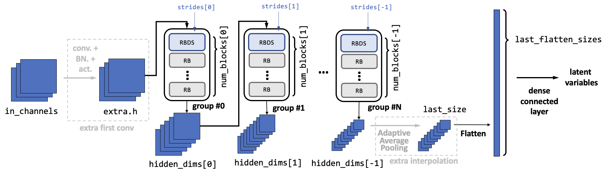

In each group, the input feature maps first go through the RBDS. Inside the RBDS, the feature map's size is reduced with the given `strides[i]` (normally it is 3, so the size will be halved). Meanwhile, the channel number is increased to the given `hidden_dims[i]`. Then the feature maps go through several RBs. The amount of RBs is `num_blocks[i] - 1`. Inside the RBs, the feature map sizes and channel number remains the same. The amount of groups is determined by the length of the `hidden_dims`. 

Before the residual block groups, an optional convolutional layer (called the `extra_first_conv`) can be added to manipulate the input channel number to a desired one. It is done by assigning the argument `extra_first_conv` to a `Tuple` with four elements: (output hidden dimension, kernel size, stride, padding).

After the residual block groups, the feature map size should be the same as assigned in `last_size`. If the `force_last_size` is set to `True`, an additional adaptive average pooling layer is applied to modify the size to a given one. Else, there will be an error raised if the `last_size` mismatch the real output size.

**Arguments**

The encoder is defined by:

```python
_encoder = Resnet18Encoder(in_channels=6, last_size: [11, 3], hidden_dims = [16, 32, 64, 128, 256], num_blocks = None, strides = None,  extra_first_conv = None, force_last_size = False)
```

- `in_channels`: (`int`)
    
    The size of channels of the profiles input to the encoder. Each channel can represent a flow variable (i.e., x, y, p, T, u, v)

- `last_size`: (`List` of `int`)
    
    The size of the feature map that is closest to the latent variables (for the encoder is the last feature map). Notice that the list does not contain the channel size.

- `hidden_dims`: (`List` of `int`)
    
    The channel size of the feature maps for each residual block group (after every RBDS). The length of the `hidden_dims` determines the number of encoder groups.

- `num_blocks`[**Default:** `2` for each group]: (`List` of `int`)
    
    The number of residual blocks (including the RBDS and RB) of each group. Then there will be one RBDS and (`num_block` - 1) RBs in that group. Every element in the list should >= 2.

- `strides` [**Default:** `2` for each group]: (`List` of `int`)
    
    The strides of each convolutional layer in the RBDS block in every group.

- `extra_first_conv` [**Default:** `None`]: (`Tuple` of `int`)
    
    The parameters of the extra first convolutional layer. If one wants to manipulate the input channel number to a desired one. If it is not a `None`, then the tuple should contain four elements, where No.1 is the desired new channel amount, No.2 is the kernel size, No.3 is the stride, and No.4 is the padding.

- `force_last_size` [**Default:** `False`]: (`bool`)

    Whether to addadditional layerss after the residual block groups in order to force the output feature map into the given `last_size`.

- `basic_layers` [**Default:** see below]: (`Dict`)
    
    Basic layers to construct the encoder. The table below shows the fundamental layers and their default values. If one want to change the default one, the value for the corresponding key should be input to the encoder with the `Class` object.

    |key|default|comment|
    |--|--|--|
    |`'preactive'`|`False`|whether to switch on the pre-active version (see above)|
    |`'actv'`|`nn.LeakyReLU`||

#### `Resnet18Decoder`

The ResNet decoder is similar to the encoder. The input latent vector is first to reshape to feature maps with assigned `last_size`. Then they will go through several groups, where each group consists of an RBUS and several RBs. 

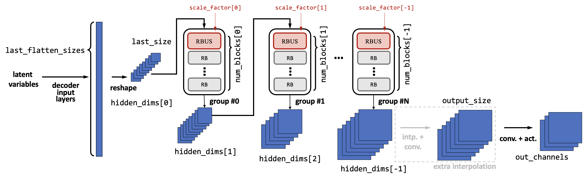

In each group, the input feature maps first go through the RBUS. Inside the RBUS, the feature map's size is increased with the given `scale_factor[i]` (should be greater than 1, and normally it is 2, so the size will be doubled). Meanwhile, the channel number is decreased to the given `hidden_dims[i+1]`. Then the feature maps go through several RBs. The amount of RBs is `num_blocks[i] - 1`. Inside the RBs, the feature map sizes and channel number remains the same. The amount of groups is determined by the length of the `hidden_dims`. 

After the residual block groups, the feature map size can be manipulated to a given output size if the argument `output_size` is given. If so, an additional interpolation layer (same as the up-sampling layer in the RBDS) is applied to modify the size to the given one. 

**Arguments**

The decoder is defined by:

```python
_decoder = Resnet18Decoder(out_channels=4, last_size=[11, 3], hidden_dims=[256, 128, 64, 32, 16], num_blocks=None, scales=None, output_size=None, basic_layers=None)
```

- `out_channels`: (`int`)
    
    The size of channels of the decoder's output. It is not always the same as `in_channels`, because usually, we input the geometry channels as well as the flow variables to the encoder, but only want the decoder to reconstruct the flow variables.

- `last_size`: (`List` of `int`)
    
    The size of the feature map that is closest to the latent variables (for the decoder is the size input to the first decoder block). Notice that the list does not contain the channel size.

- `hidden_dims`: (`List` of `int`)
    
    The channel size of the feature maps for each residual block group (after every RBUS). The length of the `hidden_dims` determines the number of decoder groups.

- `num_blocks`[**Default:** `2` for each group]: (`List` of `int`)
    
    The number of residual blocks (including the RBUS and RB) of each group. Then there will be one RBUS and (`num_block` - 1) RBs in that group. Every element in the list should >= 2.

- `scales` [**Default:** `2` for each group]: (`List` of `float`)
    
    The scale factor of each interpolation layer in the RBUS block in every group.

- `output_size` [**Default:** `None`]: (`List` of `int`)

    If this argument is assigned for a value other than `None`, additional layers will be added after the residual block groups in order to force the output feature map into the given `output_size`.

- `basic_layers` [**Default:** see below]: (`Dict`)
    
    Basic layers to construct the encoder. The table below shows the fundamental layers and their default values. If onewantst to change the default one, the value for the corresponding key should be input to the encoder with the `Class` object.

    |key|default|comment|
    |--|--|--|
    |`'preactive'`|`False`|whether to switch on the pre-active version (see above)|
    |`'actv'`|`nn.LeakyReLU`||
    |`'last_actv'`|`None`|the activation layer after the last convolutional layer (`self.fl`). For many cases, the output values on each grid is not between [0,1], so the default is not to use activation layers here.|

## Concatenetor

The concatenetor's target is to combine the **latent variables** extracted from the encoder with the **operating conditions**. There are several solutions, and there are selected through the arguments when constructing the object of the model class (`frameVAE` or `Unet`)

### Concatenation strategy

Generally speaking, there are two kinds of concatenation strategies. The difference between these two strategies is majorly in the training process. Let's consider that we are training a model to predict the flowfield of an arbitrary airfoil under an arbitrary angle of attack (AoA). The prior input is this airfoil's flowfield under the cruising angle of attack (AoAc). 

Before training, we should have a "series" database (the database will be introduced in the Pre-process section). This means we have a database of many different airfoils ( $foil_1, foil_2, \cdots, foil_{N_f}$ ), and for each airfoil $f$, we have many flowfields of this airfoil under many different operating conditions (AoA) $c_1, c_2, \cdots, c_{N_c(f)}$. Notice that the last subscript $N_c$ is a function of $f$, which means the number can be different for different airfoils. Then, each flowfield in the database can be written as 

$$\mathcal S_\text{off-design}=\{x_{c,f}\}_{f=1,2,\cdots,N_f;~c=1,2,\cdots N_c(f)}$$

Meanwhile, for each airfoil $f$, we also have a prior flowfield, which is the flowfield of the database under design AoA:

$$\mathcal S_\text{design}=\{r_{f}\}_{f=1,2,\cdots,N_f}$$

The model needs to construct the following mapping from training:

$$ \mathcal F: (r_f, c) \mapsto x_{c,f}~~\forall c, f$$

Split the mapping above into the encoder $\mathcal E$ and the decoder $\mathcal D$:

$$ \mathcal E: r_f \mapsto z_{f} \quad \forall f \qquad \mathcal D: (z_f, c) \mapsto x_{c,f}\quad \forall c,z_f $$

Then, during training, we will have two strategies to utilize the flowfield in the database:

#### Auto-encoder perspective

From the principles of the auto-encoder, the model's target is to **reconstruct** the input flowfield. From this perspective, the model can be seen as a dimension reduction tool, to extract low-dimensional representation (latent variables) $z$ from the flowfield.

However, during prediction, the input of the model can only be the reference (prior) flowfield $r_f$, and the target is to predict the flowfield $x_{c,f}$ under any operating condition $c$. Therefore, we need some more constraints during training, i.e, to force $\mathcal F(r_f, c) \rightarrow \mathcal F(x_{c,f}, c), \quad \forall c,f$

In order to reach this, we split the latent variables into two parts: the code part $z_c$ for operating condition and the flow feature part $z_f$. The following figure gives a rough description of the model. The encoder extracts the flow feature part from both the design and off-design flowfields. Then they are combined with the code part to form the complete latent variable $z$ and input to the decoder.

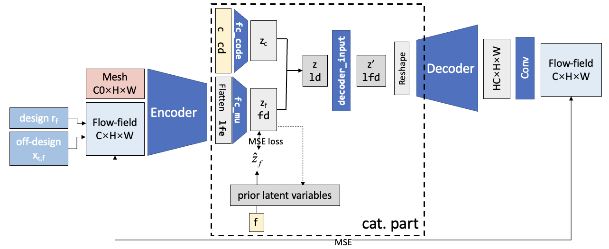

Now, we only need to ensure that the flow feature part latent variable (generated by the encoder) fulfills $\mathcal E(x_{c,f}) \rightarrow \mathcal E(r_f), \quad \forall c,f$. In other words, the $z_f$ for the off-design variable should be the same as the design variable (the prior latent variables). For simplicity, we note it as $z_f \rightarrow z_{r}$. This is realized by adding additional loss terms (code loss) into the training process, as the `MSE loss` in the figure.

However, during training, the flowfields are input to the model in random mini-batches, so we can't ensure the flowfields for one airfoil are in the same mini-batch. Thus, we can't ensure obtaining the up-to-date $z_r=\mathcal E(r_f)$ during training. To solve this problem, we proposed an **iterative training algorithm**: the prior latent variables $z_r$ are obtained after one epoch with the current encoder. The algorithm is illustrated below:

> 1. Initial the prior latent variables $z_r$ for each airfoil
> 2. for epoch = 1, ..., $N_\text{epoch}$ 
>> 3. for flowfield $x_{c,f}$ and $r_f$(ok with mini-batch)
>>> 4. get latent variable $z_f = \mathcal E(x_{c,f})$
>>> 5. get reconstruct flowfield $ x'_{c,f} = \mathcal D(z_f,c)$
>>> 6. get loss $l=\mathcal L_1(x_{c,f}, \hat x_{c,f})+\mathcal L_2(z_{f}, z_{r})+\cdots$
>>> 7. back-propagation and update model trainable parameters
>>> 8. return to 4. if there remain flowfields
>> 9. update prior latent variables: $z_r = \mathcal E(r_f)$
>> 10. return to 3. if not convergent

In the above figure, the latent variables are deterministic. They can also be stochastic, which means the $z_f$ is be seen as a normal distribution $z_f \sim \mathcal N(\mu_f, \sigma_f)$, and the encoder is to predict the distribution parameters $\mu_f, \sigma_f$ instead of predicting the $z_f$. For the decoder, the reparameterization trick is applied to sample from the distribution and give a reconstructed flowfield. 

Also, the way to deal with the operating conditions can also be different. Here we just put the real operating condition into the decoder and it is not put into the encoder part. Sometimes we want the encoder also takes the OC information when dealing with off-design flowfields. This led to several types of the concatenation part as shown below:

- Implicit: the encoder predicts the $z_c$, and another code loss is added to implicitly force the code given by the encoder to match the real code.
- Semi-implicit: the encoder predict the $z_c$, and code loss is added. But the real code instead of the predicted code is input to the decoder.
- Explicit: the encoder doesn't predict the $z_c$, and the real code is input to the last encoder layer, while it is also input to the decoder.
- None: the real code has no relation with the encoder.

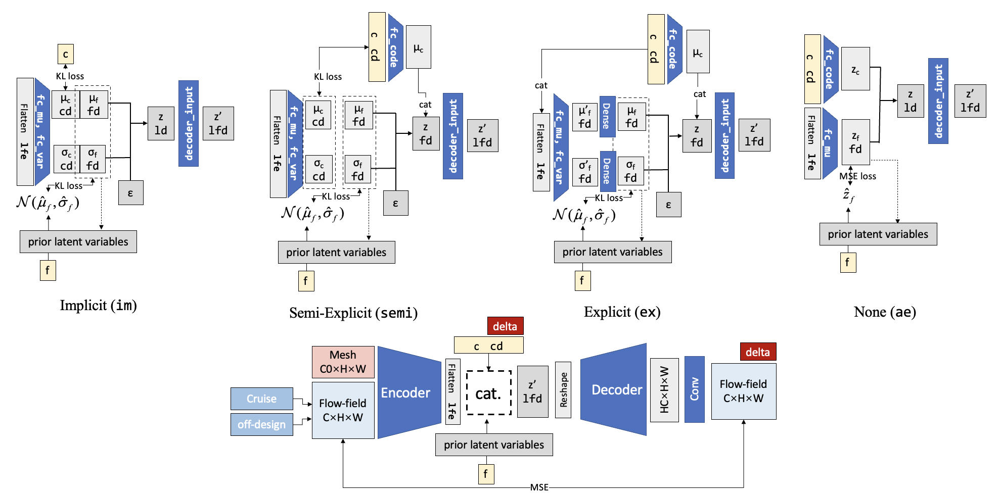

The advantage of the auto-encoder perspective is it has a clear theory basis (especially when using the Bayesian theory). The theoretical analysis can be found in the reference papers. The disadvantage is that it performs far worth than the encoder-decoder perspective below.

#### Encoder-decoder perspective

The difference of the encoder-decoder perspective is that it takes the encoder and decoder separately, and it does not require the identity of the output and input flowfield. So the target of the encoder-decoder model is to **generate** the off-design flowfield with whatever input. The input can be the mesh only (this is what most flowfield generators do), and can be the prior flowfield.

The following figure gives a rough description of the model. The encoder extract flow features $z_f$ from only off-design flowfields. Then they are combined with the code part $z_c$ to form the complete latent variable $z$ and input to the decoder.

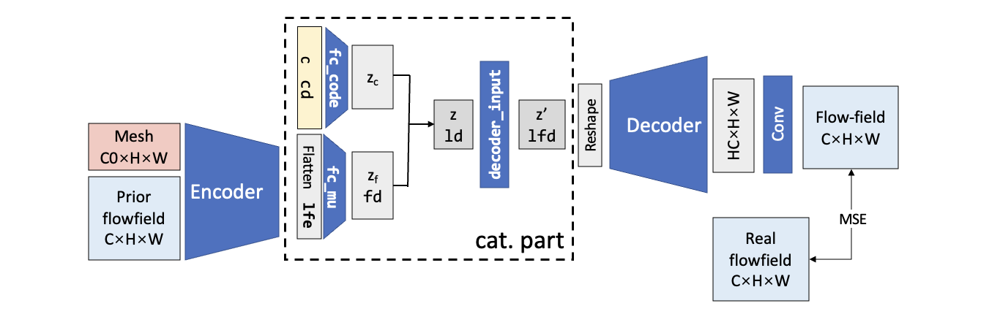

We shall notice that the $z_f$ is naturally the same for the same airfoil, so this time we don't need to add the additional loss term to ensure the flow feature part of the latent variables. The iterative training algorithm is also of no use. 

There is also variation version of the model, which is depicted in the following figure:

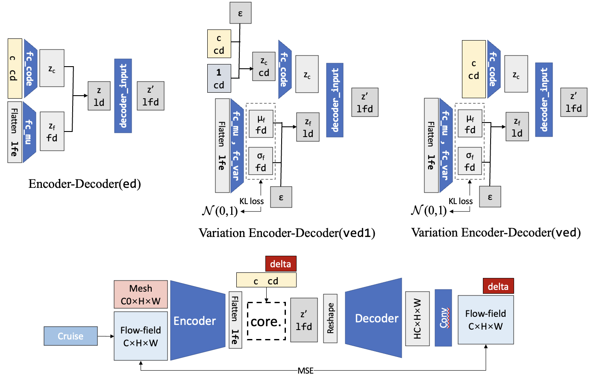

### Extra layers

There are some extra layers in the concatenation part to bridge different hidden dimensions and to improve the  performances. These extra layers can be changed according to needs.

#### Decoder input layers

Extra layers can be added between the concatenated latent variables $z$ and the input of the decoder. This is initially to bridge the different dimensions of the latent variables (`ld` = $D_{z_c} + D_{z_f}$) and the dimension needed for the decoder (`lfd` = `decoder.last_flatten_size`). This can be done with one dense connected layer. Increasing the number of the decoder input layers may have some benefits, but experiments show that there won't be many benefits.

The avilable decoder input layers are shown in below, it is assigned `decoder_input_layer` with a `int` to `frameVAE`.

|`decoder_input_layer`|layers|description|
|-|-|-|
|`0`|`nn.Identity()`|Default for densely connected decoder `mlpDecoder`, because the input dimension of the `mlpDecoder` is usually assigned as the dimension of the latent variables ($D_{z_c} + D_{z_f}$), so there is no need to bridge the difference.
|`1`| `nn.Linear(ld, lfd)`| Default for other decoder. Use a single linear layer to bridge the difference in different dimensions.|
|`2`| `nn.Linear(ld, ld*2)`, `nn.BatchNorm1d(ld*2)`, `nn.LeakyReLU()`, `nn.Linear(ld*2, lfd)`, `nn.BatchNorm1d(lfd)`, `nn.LeakyReLU()`|
| `2.5` | `nn.Linear(ld, ld)`, `nn.BatchNorm1d(ld)`, `nn.LeakyReLU()`, `nn.Linear(ld, lfd)`, `nn.BatchNorm1d(lfd)`, `nn.LeakyReLU()`|
|`3`|`nn.Linear(ld, ld)`, `nn.BatchNorm1d(ld)`, `nn.LeakyReLU()`, `nn.Linear(ld, ld*2)`, `nn.BatchNorm1d(ld*2)`, `nn.LeakyReLU()`, `nn.Linear(ld*2, lfd)`, `nn.BatchNorm1d(lfd)`, `nn.LeakyReLU()`|

#### Code input layers

Extra layers can also be added between the input condition code ( $c$, dimension = $D_c$ ) and the latent variable for the code ($z_c$, dimension = $D_{z_c}$). The purpose is to simulate the correlation among different elements of the condition code.

To construct the code input layers, you may assign the argument `code_layer` with a `List` containing a sequential of `int` numbers. Then a multi-layer neural network will be constructed, and each `int` number represents a densely connected layer with such hidden dimension. 

For example, `code_layer=[20, 30]` represents a code input layer of

```python
nn.Linear(code_dim, 20)
nn.LeakyReLU()
nn.Linear(20, 30)
nn.LeakyReLU()
```

## Loss terms

### Reconstruction, index, and code loss

The basic loss terms include reconstruction, code, and index loss. When using different code concatenate modes, the involved loss terms are not the same and are concluded in the following table.

|loss term| `im`| `semi`|`ex`|`ae`|`ed`|`ved`|`ved1`|
|-|-|-|-|-|-|-|-|
|reconstruction|√|√|√|√|√|√|√|
|index|KL-p|KL-p|KL-p|MSE-p||KL-n|KL-n|
|code|√|√|

The reconstruction loss is universal for all modes and is given by

$$\mathcal L_\text{reconstruct} = \frac 12 ||x-\hat x||^2$$

The code loss is used for the mode that needs to implicitly force the code generated by the encoder to be the same as the real code. It is given by 

$$\mathcal L_\text{code} = \frac 12 ||\mu_c-c||^2$$

The index loss is a bit complex. It is used to control the flow-feature part latent variables $z_f$ to satisfy restrictions. For different concatenate modes, the restrictions are different:

- **KL-p**:  Kullback-Leibler divergence (KL divergence) to the prior latent variables $z_r$. This kind of index loss is applied to `im`, `semi`, and `ex`, in order to force the distribution $z_f \rightarrow z_r$. Suppose they both obey the normal distribution, then we have:

    $$\mathcal L_\text{index} = KL\left(\mathcal N(\mu_f, \sigma_f), \mathcal N(\mu_r, \sigma_r)\right) =-\frac 12 \sum_{j=1}^J \left[ \log \frac{\sigma_{1,j}^2}{\sigma_{2,j}^2} - \frac{\sigma_{1,j}^2}{\sigma_{2,j}^2} - \frac{(\mu_{1,j}-\mu_{2,j})^2}{\sigma_{2,j}^2} +1 \right]$$

- **MSE-p**:  Mean square error to the prior latent variables $z_r$. This kind of index loss is applied to `ae`, in order to force the deterministic $z_f \rightarrow z_r$. Suppose they both obey the normal distribution, then we have:

    $$\mathcal L_\text{index} = MSE\left(\mathcal z_f, z_r\right) =\frac 12 ||z_f-z_r||^2$$

- **KL-n**：  KL divergence to the standard normal distribution $\mathcal N(0,1)$. This can be seen as the original version of the variance operation. It is applied to `ved` and `ved1`, to give a stochastic version of the encoder-decoder's latent variables. The flow-feature latent variables that the encoder extracts from the prior flowfield are seen as a normal distribution, and the KL loss will force it to the standard normal distribution:

    $$\mathcal L_\text{index} = KL\left(\mathcal N(\mu_f, \sigma_f), \mathcal N(0, 1) \right) =-\frac{1}{2} \sum_{j=1}^{J}\left(1+\log \sigma_j^{2}-\sigma_{j}^{2}-\mu_{j}^{2}\right)$$

### Physics-based loss

Loss terms based on flow physics may provide more information to the model when training and help avoid overfitting when using a limited dataset, which may improve the model’s generalization ability. In this paper, two loss terms are proposed.

The flowfield near the airfoil is expected to be more crucial than other parts of the flowfield, since the elements near the airfoil primarily determine the performance of the airfoil. The aerodynamic forces, including the lift coefficient, $C_L$, and drag coefficient, $C_D$, are calculated by integrating the pressure force and shear stress around the wall boundary; therefore, these coefficients are selected to guide the model to focus more on the flow near the wall by adding their prediction error to the loss function. Consequently, the loss term of aerodynamic forces is expected to guide the model to better predict the flowfields of new airfoils.

In the training and testing process, the coefficients are extracted from the flowfield data by an in-house post-process program. The non-dimensional forces are first obtained on each grid cell of the first layer next to the airfoil surface and then summed to get the lift and drag coefficients.

The predicted lift and drag coefficients obtained from the reconstructed flowfield are denoted as $\hat C_L$ and $\hat C_D$ . The coefficients computed from CFD are $C_L$ and $C_D$. The lift coefficients range from 0.6 to 1.0 and the drag coefficients range 0.003 from 0.083. Since these values are not close to zero, the aerodynamic loss term is defined as:

$$\mathcal{L}_{\text {Aero }}=\left(\frac{\left|\hat{C}_L-C_L\right|}{C_L}+\frac{\left|\hat{C}_D-C_D\right|}{C_D}\right)$$

Conservation of mass, momentum, and energy are fundamental physical laws that apply to fluid flow. Since the calculation of momentum and energy losses involves information on the turbulence fields, which are not predicted by the model, only mass conservation loss is considered in this paper. 

The mass flux is calculated cell by cell for each reconstructed flowfield and is minimized by adding a corresponding term to the loss function. In the framework of the finite volume solver, the flow variables are stored at the cell center. The flow variables are interpolated from the cell center to the grid edge to calculate the mass flux, as shown in the figure.

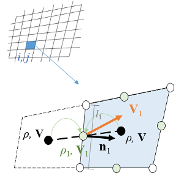

Then, the mass flux of the grid cell can be calculated as 

$$\Phi_{\mathrm{m}, i j}=\sum_{k=1}^4 \rho_k\left(\mathbf{V}_k \cdot \mathbf{n}_k\right) l_k$$

where the density, $\rho$, can be calculated based on the pressure and temperature of the cell. Finally, the mass residual is compared with the residual of the CFD result and the positive deltas are counted for the loss function of the model:

$$\mathcal L_\text{Mass} =\Phi_{\mathrm{m}}=\max \left(0, \sum_{i j} \Phi_{\mathrm{m}, i j}-\Phi_{\mathrm{m}, i j}^{(\mathrm{real})}\right)$$