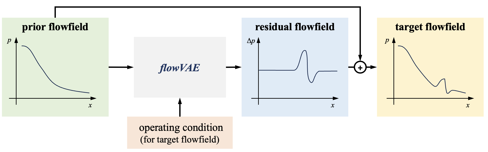

# Motivations

## Prior-based multi-design-point prediction

During aerodynamic shape optimization (ASO), it is usually not enough to only optimize the **design point performance** since it may cause undesired performance losses at **off-design points**. Therefore, an important task of ASO is to fast and accurately predict a series of flowfields and their aerodynamic performances. 

The compuatational fluid dynamic (CFD) method is usually used to obtain such a series of flowfield, yet it leads to large compuation cost and may not be a wise choise during ASO which needs each sample to be evaluated fast. Thus, we can leverage the capability of the deep nerual network (DNN) and construct a DNN-based surrogate model to calculate the massive off-design flowfields.

In order to improve the prediction accuracy, the FlowGen is designed to predict a series of off-design flowfields with a **prior flowfield** as reference. The advantages are two-folded.

### Introducing the *Prior*

Normally, the design point and off-design points flowfields have strong relationships. It is because that the variation of the flowfield with the design parameters (i.e., the freestream Mach number) is continuous and the flow structures maintain the same. 

Therefore, **introducing the design flowfield as the input** (in the statistic perspective, as the *prior*) **when generating the off-design flowfields should improve model's perfromance**.

### Residual learning

Another motivation to introducing design flowfield when predicing off-design flowfield is from the common understand of the deep neural network. Since the ResNet, people has know that DNN is easier to learn a 0 - 0 mapping than a non-zero identical learning. In another word, the model's performance can be improved by subtracing the same part. 

Therefore, there's an option in FlowGen to make the model predicting the **difference** (or the residual) **between the target flowfield** (in most time, the off-design flowfield) **and the prior flowfield** (the design flowfield). 

## Physics-based loss terms

TODO

## Physics-embedded transfer learning

TODO