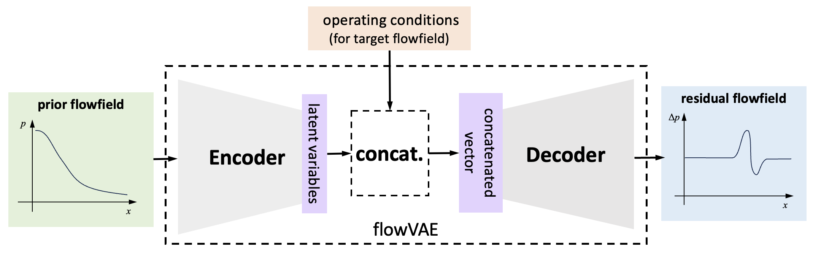

[TOC]

# Guide to the code

This section introduces how to set up and run the prediction model..

## Installation

You can either fork the code or download the latest .zip to your working folder.

Then, open the command at the working folde and install the `FloGen` with:

```powershell
python setup.py install
```

If you want to make some modification to the code, use 

```powershell
python setup.py develop
```

## Dataset establishment

The first thing to do before training is to establish a dataset. The dataset is slightly different from the ordinary one, a **series dataset**.

This means we have a database of many different prior flowfields 

$$ \mathcal S_\text{prior}=\{r_{f}\}_{f=1,2,\cdots,N_f} $$

(for example, the flowfield under design cruise condition of many different airfoils: $foil_1, foil_2, \cdots, foil_{N_f}$ ). 

Meanwhile, in order to train the model supervised, for each prior flowfield $f$, we also need many target flowfields. 

$$\mathcal S_\text{target}=\{x_{c,f}\}_{f=1,2,\cdots,N_f;~c=1,2,\cdots N_c(f)}$$

(for example, the flowfield of each airfoil under many different operating conditions (AoA) $c_1, c_2, \cdots, c_{N_c(f)}$.) 

The complete database can be written as:

$$\mathcal{S}=\left\{r_f,\left\{x_{c, f}\right\}_{c=1,2, \cdots N_c(f)}\right\}_{f=1,2, \cdots, N_f}$$

where the flowfields for the same $f$ is called one **series**, or one group.

> Notice that the last subscript $N_c$ is a function of $f$, which means the number can be different for different airfoils. 

### Prepare data

The data should be stored in two `.npy` files in advance. (there are some examples in section `flowfield dataset`).

#### data

The first data file contains the flowfields, which should be named `data<yourname>.npy`, where `<yourname>` can be replaced to any legal string. Its shape should be 

$$ (N_\text{prior flowfields} + N_\text{target flowfields}) \times N_\text{channel} \times H [\times W ]$$

- The first dimension is the total number of the prior and target flowfields. 

- The second dimension is the number of channels. In flowfield reconstructing tasks, each channel can represent a mesh coordinate (i.e., x, y) or flow variables (i.e., p, T, u, v).

- The third dimension and the rest dimensions are for each flowfield. If the input data is a profile (like a pressure profile on the airfoil surface), then it should be only the third dimension. If the input data is a field, then there should be the third and the fourth dimension.

#### index

The first data file contains the index information of the flowfields, which should be named `index<yourname>.npy`, where `<yourname>` is the same as in `data<yourname>.npy`. Its shape should be 

$$ (N_\text{prior flowfields} + N_\text{target flowfields}) \times N_\text{info} $$

For each flowfield, $N_\text{info}$ values can be stored. They should obey the format below:

|index|note|description|
|-|-|-|
|0| $i_f$|Index of the prior flowfield|
|1| $i_c$|Index of the current flowfield's condition among its series|
|2||Index of the prior flowfield's condition among its series |
|3 ~ 3+DC| $c$ | The condition values of the current flowfield (The length of this part depends on the dimension of a condition code)|
|4+DC~4+2DC| | The condition values of the prior flowfield of its series (The length of this part depends on the dimension of a condition code)|
|more| |Auxilary data|

### Import dataset with `ConditionDataset`

The dataset should be constructed before training with the following code:

```python
from flowvae.dataset import ConditionDataset as Cd

fldata = Cd(file_name='<yourname>', d_c=1, c_mtd='all', n_c=None, c_map=None, c_no=1, test=100, data_base='data/', is_last_test=True, channel_take=None)
```

> **Remark for saving the index**
> Sometimes we need to save the list of which flowfields we have chosen for training. 
>The `ConditionDataset` is designed to do so: when `c_mtd` is other than `'load'`, an index list will be saved in the `data_base` folder with the name `<yourname>_<c_no>dataindex.txt`. So next time when you want to use this index map, simply use `c_mtd='load'` and assign the desired `c_no`.
>The `ConditionDataset` is designed to do so: when `c_mtd` is other than `'load'`, an index list will be saved in the `data_base` folder with the name `<yourname>_<c_no>dataindex.txt`. So next time when you want to use this index map, simply use `c_mtd='load'` and assign the desired `c_no`.

The arguments of the `ConditionDataset` is:

|argument|type|description|
|-|-|-|
|`file_name`|`str`| name of the data file||
|`d_c`| `int` | dimension of the condition values|
|`c_mtd`|`str`| for each series, sometimes we want to choose *some* of it for training. This argument decides how to choose the conditions used in training<br/>- `fix` :   by the index in `c_map`<br/>-`random`: randomly select `n_c` conditions when initializing the dataset<br/>- `all`:    all the conditions will be used to training<br/>- `exrf`:   except the index of prior flowfield conditions<br/>- `load`:   load the selection method by the file number `c_no` (use `save_data_idx(c_no)` to save)|
|`n_c`|`int`| **Default:** `None` <br/> (`c_map` = `random`) <br/> number of the condition of one airfoil should the dataset give out
|`c_map`| `List` | **Default:** `None` <br/> (`c_map` = `fix`) <br/>fix index number
|`c_no`| `int` | **Default:** `-1` <br/> (`c_map` = `load`) <br/>  number of saved data index
|`test`| `int` | **Default:** `-1` <br/>  the amount of data not involved in training
|`is_last_test` | `bool` | **Default:** `True` <br/> if true, the last samples will be used as test samples; if false, randomly selected
|`data_base` | `str` | **Default:** `'\data'` <br/> the folder path of `data.npy` and `index.npy`
|`channel_take` | `List` | **Default:** `None` <br/> if not None, the assigned channels will be used for training, while the others are left

### Several useful functions of `ConditionDataset`

During training, the `ConditionDataset` act like the origin `Dataset` in Pytorch. There are several extra functions you may interested in for post-process or other circumstances:

**`get_series`**

```python
fldata.get_series(idx, ref_idx=None)
```
**function:** Return the whole series flowfield of the assigned series index ( $i_f$ ).

**arguments:**: 

- `idx`: `int` the series index ( $i_f$ )

**return:** `Dict` with `{'flowfields': flowfield, 'condis': condis, 'ref': ref, 'ref_aoa': ref_aoa}`

- `'flowfield'`: `np.ndarray` (size: $N_c(f) \times C \times H \times W$), the flowfields of the assigned series 
- `'condis'`:  `np.ndarray` (size: $N_c(f) \times D_c$) , the operating condition values of the assigned series 
- `'ref'`: `np.ndarray` (size: $C \times H \times W$), the prior flowfields of the assigned series 
- `'ref_aoa'`:  `np.ndarray` (size: $D_c$), the operating condition values of the prior flowfield in the assigned series 

**`get_index_info`**

```python
fldata.get_index_info(i_f, i_c, i_idx)
```
**function:** Return the value in a specific position in `index.npy`.

**arguments:**: 

- `i_f`: `int` the series index ( $i_f$ )
- `i_c`: `int` the condition index in the series ( $i_c$ )
- `i_idx`: `int` the index of the information vector

**return:** the value 

## Construct the model

The backbone of the FloGen is the Encoder-Decoder model or its variational version, VAE. To predict a series of off-design flowfields, the operating condition for the target flowfield needs to be introduced. The model can be divided into three procedures as shown in the figure: 



- The **Encoder** extracts *latent variables* (also can be seen as the statistic features) from the input prior flowfield.

- The **Concatenetor** combines the *latent variables* (only related to the prior flowfield) and the *operating condition* of the target flowfield. There are several strategies to do the above combination, both deterministic and stochastic, and will be introduced in the sections below.

- The **Decoder** takes the concatenated vector as input, and generates the target flowfield.

### Set the encoder and decoder

To construct the model, we first need to assign the proper encoder and decoder:

```python
from flowvae.base_model import convEncoder_Unet, convDecoder_Unet

_encoder = convEncoder_Unet(in_channels=2, last_size=[5], hidden_dims=[64, 128, 256])
_decoder = convDecoder_Unet(out_channels=1, last_size=[5], hidden_dims=[256, 128, 64, 64], sizes = [24, 100, 401], encoder_hidden_dims=[256, 128, 64, 2])
```
The table below shows the available encoder and decoder classes.

| Type | Encoder | Decoder | 
|--|--|--|
| base class| `Encoder` | `Decoder` | 
| dense connected | `mlpEncoder` | `mlpDecoder` | 
| convolution (1D/2D) | `convEncoder` | `convDecoder` | 
| Unet convolution (1D/2D) | `convEncoder_Unet` | `convDecoder_Unet` | 
| ResNet | `Resnet18Encoder` | `Resnet18Decoder` | 

For more details on the encoder and decoder, please see [here](#encoder--decoder)

### Set the model

Then we can construct the predicting model with the assigned encoder and decoder. This is done by constructing a `frameVAE` or `Unet` class. They are arguments of them are the same, like:

```python
vae_model =  frameVAE(latent_dim=12, encoder=_encoder, decoder=_decoder, code_mode='ved1', dataset_size=None, decoder_input_layer=0, code_dim=1, code_layer=[], device = 'cuda:0')
```

The arguments of the `frameVAE` and `Unet` are:

|argument|type|description|
|-|-|-|
|`latent_dim`| `int` |   the total dimension of the latent variable (include code dimension)
|`encoder`| | the encoder
|`decoder`| | the decoder
|`code_mode`| `str` | the mode to introduce condition codes in the concatenator. See the table below.
|`code_dim`| `int` | **Default**  `1`<br/> the condition code dimension (same as that in the dataset)
|`device`|| **Default**  `cuda:0`<br/> training device
|`dataset_size`| `Tuple` | **Default** `None`<br/> (`code_mode` = `'im'`, `'semi'`, `'ex'`, `'ae'`)<br/> the size to initial the prior latent variable storage. The size should be ($N_f$, $N_c$)
|`decoder_input_layer`| `float` | **Default**  `0`<br/> the amount of dense connect layers between latent variable `z` and the decoder input, see [Decoder input layers](#decoder-input-layers)|
|`code_layer`|`List`|**Default**  `[]`<br/> (`code_mode` = `'semi'`, `'ex'`, `'ae'`, `'ed'`, `ved`, `ved1`)<br/> The layers between the real condition code input and where it is concatenated to the latent variables, see [Coder input layers](#code-input-layers)

The available concatenator mode can be found in the following table, see [Concatenetion strategy](#concatenetion-strategy) for details.

|perspective|probabilistic|implicit|semi-implicit|explicit|none|
|-|-|-|-|-|-|
|ae|d.||||`ae`|
|ae|vf.|`im`|`semi`|`ex`||
|ed|d.||||`ed`|
|ed|v.||||`ved`|
|ed|vf.||||`ved1`|

ae = auto-encoder perspective, ed = encoder-decoder perspective
d. = deterministic, v. = variational, vf. = only variational with flow features

## Training

### Set operator

To train the model, we need another class, the operator `AEOperator`, to conduct the training process:

```python
op = AEOperate(opt_name='<new>', model=vae_model,  dataset=fldata,
                recon_type='field',
                input_channels=(None, None),
                recon_channels=(1, None),
                num_epochs=300, batch_size=8, 
                split_train_ratio=0.9,
                recover_split=None,
                output_folder="save", 
                shuffle=True, ref=False,
                init_lr=0.01)
```

The arguments of the `AEOperator` are:

|argument|type|description|
|--|-|-|
|`opt_name` | `str` |  name of the problem
|`model` | `frameVAE` | the model to be trained
|`dataset` | `ConditionDataset` | The dataset to train the model|
|**Save & Load**
|`output_folder`|`str`|**Default**  `'save'`<br/> The path to set up a new folder called `opt_name` and save the checkpoints
|**Training**
|`init_lr`|`float`|**Default**  `'0.01'`<br/> The initial learning rate
|`num_epoch`|`int`|**Default**  `'300'`<br/> The maximum number of training epoch
|**Dataset**
|`split_train_ratio`|`float`|**Default**  `0.9`<br/> The ratio of the training dataset, the rest will be the validation dataset. The latter is not involved in the training but is monitored to avoid over-fitting. Notice that the test dataset is split when constructing the `ConditionDataset`.
|`recover_split`|`str`|**Default**  `None`<br/> Whether to recover the split of the dataset (train and validation dataset). If it is `None`, the dataset will be randomly split with the `split_train_ratio`, and the split result will be saved in `'<output_folder>/<optname>/dataset_indice'`. If it is not, the split will be recovered from `'<output_folder>/<recover_split>/dataset_indice'`<br/> 
|`batch_size` | `int` | **Default**  `8`<br/>  The mini-batch size (argument for `torch.utils.data.DataLoader`)|
|`shuffle` | `bool` | **Default**  `True`<br/>  Whether to shuffle the dataset when training (argument for `torch.utils.data.DataLoader`)|
|**Model**
|`ref`|`bool`|**Default**  `False`<br/> Whether to use the *residual learning* strategy, i.e., to use the residual value of the operating condition, and to reconstruct the residual field
|`input_cahnnels`|`Tuple[int, int]`| **Default**  `(None, None)`<br/> The lower and upper range of the channels to input to the model. If the range is `None`, means on this direction there is no interception. <br/> *Remark.* The channel number should match the `in_channels` of the encoder
|`recon_cahnnels`|`Tuple[int, int]`| **Default**  `(1, None)`<br/> The lower and upper range of the channels that are to be compared with the output of the model. If the range is `None`, means on this direction there is no interception.<br/> *Remark.* The channel number should match the `out_channels` of the decoder
|`recon_type`| `str` | **Default**  `'field'`<br/> 

### Set loss parameters

Then, we also need to set some parameters for the loss calculation. There are several loss terms involved in the training process. They are [basic loss terms]((#reconstruction-index-and-code-loss)) (include the reconstruction, code, and index loss) and the [physics-based loss terms](#physics-based-loss) (include the NS loss and the aerodynamic loss). 

When using different code concatenate modes, the involved basic loss terms are not the same and are concluded in the following table.

|loss term| `im`| `semi`|`ex`|`ae`|`ed`|`ved`|`ved1`|
|-|-|-|-|-|-|-|-|
|reconstruction|√|√|√|√|√|√|√|
|index|KL-p|KL-p|KL-p|MSE-p||KL-n|KL-n|
|code|MSE|MSE|||||

- **KL-p**:  Kullback-Leibler divergence (KL divergence) to the prior latent variables $z_r$. 
- **MSE-p**:  Mean square error to the prior latent variables $z_r$. 
- **KL-n**：  KL divergence to the standard normal distribution $\mathcal N(0,1)$.

The physics-based loss terms can be added as you want. It is only related to the reconstructed flowfield.

To manipulate the loss parameters, you can use the following sentence:

```python
op.set_lossparas()
```

All of the parameters have default values, so only need to put the parameters you want to change into the arguments. The arguments related to the code and index loss are:

|key | type | default | description|
|-|-|-|-|
|`code_weight`| `float` | `0.1`| the weight of code loss, better for 0.1         
|`indx_weight`| `float` | `0.0001`| the weight of index KLD loss  
|`indx_epoch`| `int` | `10`| the epoch to start counting the index KLD loss 
|`indx_pivot`| `int` | ` -1`| the method to get avg_latent value <br/> - if it is a positive number, use the latent value of that condition index <br/> - if `-1`, use the averaged value of all condition index

The arguments related to the physics-based loss are:

|key | type | default | description|
|-|-|-|-|
|`sm_mode`|`str`|`'NS'`|the mode to calculate smooth loss<br/>   - `NS`:     use navier-stokes equation's conservation of mass and moment to calculate smooth<br/>   - `NS_r`    use the residual between mass/moment flux of reconstructed and ground truth as loss<br/>   - `offset`  offset diag. the field for several distances and sum the difference between the field before and after move\n<br/>   - `1d`      one-dimensional data (adapted from Runze)
|`sm_epoch`| `int` | `1` | the epoch to start counting the smooth loss 
|`sm_weight`| `float` | `0.001`| the weight of the smooth loss
|`sm_offset`| `int` | `2 `| (`sm_epoch`=`offset`) the diag. direction move offset
|`moment_weight`| `float` | `0.0 `| (`sm_epoch`= `NS`, `NS_r`) the weight of momentum flux residual
|`aero_weight ` | `float` | `1e-5`| the weight of aerodynamic loss
|`aero_epoch` | `int` | `299`| the epoch to start counting the aero loss 

### Set the optimizer and scheduler

Then we need to set the optimizer and the scheduler to train the model. They are based on `torch.optim`, and assigned to the operator as follows:

```python
op.set_optimizer(<optimizer_name>, <keyword arguments of the optimizer>)
op.set_scheduler(<scheduler_name>, <keyword arguments of the scheduler>)
```

Both the `set_optimizer` and `set_scheduler` have the first argument to be the *Class name* in `torch.optim` and `torch.optim.lr_scheduler`. Then the rest arguments should be the keyword arguments of the assigned optimizer and scheduler. Here is an example:

```python
op.set_optimizer('Adam', lr=0.01)
op.set_scheduler('ReduceLROnPlateau', mode='min', factor=0.1, patience=5)
```

**Recommended setting**

The optimizer is default set to `'Adam'` with the `init_lr` assigned when initializing the `AEOperator`. If you want to change the optimizer, set it explicitly after constructing the `AEOperator`.

The scheduler is recommended to use the warmup strategy. It first increases the learning rate from a smaller value, and then reduces it. The FloGen provides two warming-up strategies in `flowvae.utils`

1. Warmup with exponent

    ```python
    from flowvae.utils import warmup_lr

    op.set_scheduler('LambdaLR', lr_lambda=warmup_lr)
    ```
    
    $$\mathrm{LR} = \mathrm{LR}_\text{init} \times \left\{\begin{array}{lc} 1+0.5 \times \text { epoch, } & \text { epoch }<20 \\ 10 \times 0.95^{\text {epoch-20, }}, & \text { epoch }\ge 20 \end{array}\right.$$

2. Warmup with plateau

    ```python
    from flowvae.utils import warmup_plr_lr

    op.set_scheduler('LambdaLR', lr_lambda=warmup_plr_lr)
    ```
    
    $$\mathrm{LR} = \mathrm{LR}_\text{init} \times \left\{\begin{array}{ll} 1+0.5 \times \text { epoch, } & \text { epoch }<20 \\ 10 , & 20 \le \text { epoch }\le 50  \\ 1  , & 50 \le \text { epoch }\le 100 \\ 0.1 , & 100 \le \text { epoch }\le 150 \\ 0.01 , & 150 \le \text { epoch }\le 200 \\ 0.001 , & 200 \le \text { epoch }\le 250 \\ 0.0001 , & 250 \le \text { epoch }\end{array}\right.$$

### Train the model

To train a model, use:

```python
op.train_model(save_check=100, save_best=True, v_tqdm=True)  
```

The arguments

- `save_check`: (int) the interval between the checkpoint file is saved to the given path `output_path`
- `save_best`: (bool) **default**: `True` whether to save the best model

- `v_tqdm`: (bool) **default**: `True` whether to use `tqdm` to display progress. When writing the IO to files, `tqdm` may lead to fault.

## Post process

After the model is trained, the FloGen provides several useful functions to post-process the reconstructed flowfield data. Most of them aim to obtain the aerodynamic coefficients of the surfaces in the flowfield.

### Use the model to predict

First, we need to call the model to predict the flowfield of the new airfoil and/or under new operating conditions. This can be done with the `encode` and `sample` functions in the `frameVAE` class. The `encode` is used to obtain the latent variables (`mu` and `log_var`) from the new prior flowfield, and the `sample` generate the new flowfield with the given operating condition (`code`), and the latent variables. Here is an example:

```python
#* construct the prior flowfield and prior condition
aoa_ref = torch,from_numpy(np.array([1.0])) # prior condition is 1.0
data_ref = torch.from_numpy(np.concatenate(geom, field_ref), axis=0) # prior flowfield
data_ref = data_ref.float().unsqueeze(0).to(device) # add the batch channel and move to device

#* use the encoder to obtain latent variables (or its distribution)
mu, log_var = vae_model.encode(data_r)

#* generate the airfoil's new profiles under other operating conditions with the model
for aoa in aoas:
    aoa_residual = aoa - aoa_ref # get residual operating conditions
    field_residual = vae_model.sample(num_samples=1, code=aoa_residual, mu=mu, log_var=log_var) # sample the latent variables and get the residual field
    field_reconstruct = field_residual + field_ref

```

There are some remarks to the above code:

1. The function `encode` takes the batch version of the input. So don't forget to add the batch channel with `unsqueeze(0)` if the input don't have that channel.
2. During prediction, no matter what the concatenation strategy is, the decoder only need the latent varialbes of the prior field. So `mu` and `log_var` can obtained in advance, and no need for update during the prediction of one airfoil.
3. The `vae_model.sample` is automatically adaptive to the concatenation strategy. It means that:
    - if the strategy is stochmatic, several latent variables will be sampled from the distribution of the l.v. and be input to the decoder, and each of the latent variables will lead to a result reconstruct field. This gives a way to evaluate the uncertainty of the reconstruct field. The number of the samples can be assigned by `num_sample`.
    - if the strategy is deterministic, no sampling process takes place, and the argument `log_var` will be ignored. It is also no need to assign a `num_sample` greater than one.
4. The Unet decoder needs feature maps from the encoder, but the batch dimension of the feature maps (usually is 1) may be different from the decoder (equals `num_sample`). The FloGen provide a function to multiplize the encoder's feature map: `vae_model.repeat_feature_maps(num_sample)`

### Calculate aerodynamic coefficients from the reconstruct fields

There are some functions to obtain the angle of attack, lift, and drag from a 2D flowfield. They are listed in the table below:

|name|description|arguments|returns|
|-|-|-|-|
|`get_aoa(vel)`|extract the angle of attack(AoA) from the far-field velocity field| - `vel`:   the velocity field, shape: (2 x H x W), the two channels should be U and V (x and y direction velocity) <br/> Only the field at the front and far-field is used to average.|(`torch.Tensor`): the angle of attack
|`get_p_line(X, P, i0=15, i1=316)`|extract pressure values at the airfoil surface from the pressure field `P`. The surface p-value is obtained by averaging the four corner values on each first-layer grid.| - `X`:    The X field, shape: (H x W)<br/> - `P`:    The P field, shape: (H x W)<br/> - `i0` and `i1`:  The position of the start and end grid number of the airfoil surface | Tuple(`torch.Tensor`, `List`):  `X`, `P` (shape of each: (i1-i0, ))|
|`get_vector(X: Tensor, Y: Tensor, i0: int, i1: int)` | get the geometry variables on the airfoil surface <br/> **Remark:** should only run once at the beginning, since is very slow | - `X`:    The X field, shape: (H x W) <br/> - `Y`:    The Y field, shape: (H x W) <br/> - `i0` and `i1`:  The position of the start and end grid number of the airfoil surface | `torch.Tensor, torch.Tensor, torch.Tensor`: <br/> `_vec_sl`, `_veclen`, `_area` <br/> - `_vec_sl`:  shape : `(i1-i0-1, 2)`, the surface section vector `(x2-x1, y2-y1)` <br/> - `_veclen`:  shape : `(i1-i0-1, )`, the length of the surface section vector <br/> - `area`:     shape : `(i1-i0-1, )`, the area of the first layer grid (used to calculate tau)
|`get_force_xy(vec_sl: Tensor, veclen: Tensor, area: Tensor, vel: Tensor, T: Tensor, P: Tensor, i0: int, i1: int, paras: dict, ptype: str = 'Cp')`| integrate the force on x and y direction| - `_vec_sl`, `_veclen`, `_area`: obtained by `_get_vector` <br/> - `vel`:   the velocity field, shape: (2 x H x W), the two channels should be U and V (x and y direction velocity)<br/> - `T`:    The temperature field, shape: (H x W)<br/> - `P`:    The pressure field, shape: (H x W); should be non_dimensional pressure field by CFL3D <br/> - `i0` and `i1`:  The position of the start and end grid number of the airfoil surface<br/> - `paras`:    the work condtion to non-dimensionalize; should include the key of (`gamma`, `Minf`, `Tinf`, `Re`)| `Tensor`: (Fx, Fy) The x and y direction force
|`get_force_cl(aoa: float, <same parameter as get_force_xy>)` | get the lift and drag | `aoa`:  angle of attack  <br/> - The rest parameters are the same with `get_force_xy` |`Tensor`: (CD, CL) The drag coefficients and the lift coefficients

There are some functions to obtain the x,y direction force from a 1D pressure profile. They are listed in the table below:

|name|description|arguments|returns|
|-|-|-|-|
|`get_xyforce_1d(geom: Tensor, profile: Tensor)` | integrate the force on x and y direction | - `geom`:    The geometry (x, y), shape: (2, N)  <br/> - `profile`: The pressure profile, shape: (N, ). It should be non_dimensional pressure profile by freestream condition:  <br/> $$C_p = \frac{p - p_\text{inf}}{0.5\rho u^2} $$ | `Tensor` (Fx, Fy)|
| `get_force_1d(geom: Tensor, profile: Tensor, aoa: float)` | integrate the lift and drag| - `geom`:    The geometry (x, y), shape: (2, N) <br/> - `profile`: The non-dimension pressure profile, shape: (N, ), same as in `get_xyforce_1d` <br/> - `aoa`:  angle of attack | `Tensor` (CD, CL)|
|`get_flux_1d(geom: Tensor, pressure: Tensor, xvel: Tensor, yvel: Tensor, rho: Tensor)` | obtain the mass and momentum flux through a line | - `geom`:    The geometry (x, y), shape: (2, N)  <br/> - `pressure`: The pressure on every line points, shape: (N, ); should be *dimensional* pressure profile  <br/> - `xvel`: x-direction velocity on every line points, shape: (N, )  <br/> - `yvel`: y-direction velocity on every line points, shape: (N, )  <br/> - `rho`: density on every line points, shape: (N, ) | `Tensor` (mass_flux, moment_flux)|

To speed up calculation for series data, it has a batch version, where the input and output both add the first channel for batch size.
|origin name|batch version name|
|-|-|
|`get_force_1d`|`get_force_1dc`|
|`get_xyforce_1d`|`get_xyforce_1dc`|
