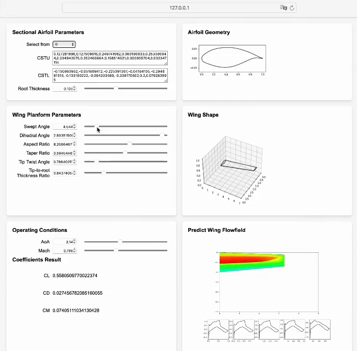

# Web-wing - Interactive Transonic Wing Design App

The physics-embedded transfer learning for transonic wing is demonstrated with a simple interactive app. The data-driven model is trained on RANS data, therefore has much better accuracy than existing fast aerodynamic prediction tools. Feel free to modify the airfoil geometry, wing planform geometry, and wing operating conditions to see what will happed on the wing surface flow field, and your knowledge on wing aerodynamics will grow.

The next step of the app is a gradient optimization tool for wing performance, which will come soon.

## Installation

The app only has local-running version now because we can not afford a server. Please follow the steps below to run the code.

1. Install required packages

    The web-Wing requires `numpy`, `pytorch`, `matplotlib`, and `tqdm` to be installed. The user interface is implemented with `flask`. You can install them with `pip` or `conda`.

2. Download libraries

    The web-Wing requires three projects: `floGen`, `cfdpost`, and `cst-modeling3d` on [GitHub](https://github.com/YangYunjia). You can download the latest version from repositories, and unzip them. Intall three libraries with running `python setup.py install` at the root directory of each library.

3. Download trained model parameters

    The model parameters can be download from the [Tsinghua University cloud](https://cloud.tsinghua.edu.cn/f/2da76b2b4b714d31aca1/?dl=1). Unzip the download and move the folder `saves` to `<floGen folder>/examples/wing`

Then, the wing-app should be able to start.

1. Start local server

    change directory to `<floGen folder>/examples/wing` and run `python app.py`.

2. Start browser

    go to `127.0.0.1:5000` in your browser.

## User guide

The web-Wing is trained with RANS data and focus on the single section wing. The sectional airfoil is fixed along spanwise except its thickness. 

The parameters include:

|Parameter|Symbol	|Definition|Range|Comments|
|-|-|-|-|-|
|CSTU| $u_i, i=0,\cdots,9$ |||These parameters defines the shape of the upper airfoil surface curve. Definition of CST parameters can be found in `cst-modeling3d`|
|CSTL| $l_i, i=0,\cdots,9$ |||These parameters defines the shape of the lower airfoil surface curve.|
|Root thickness| $ (t/c)_\text{max}$ | | 0.08 - 0.13 | relative thickness of root|
|sweep angle	|$\Lambda_\text{LE}$	| |0° - 35°| leading edge|
|dihedral angle	|$\Gamma_\text{LE}$	| |0° - 3°| leading edge|
|aspect ratio	|$AR$	| $\frac{b_{1/2}^2}{2S_{1/2}}$ |6 - 10|
|tapper ratio	|$TR$	| $\frac{c_\text{tip}}{c_\text{root}}$ | 0.2 - 1.0|
|tip twist angle	|$\alpha_\text{twist}$	||0° - -6°|
|tip-to-root thickness ratio |$r_t$	||0.8 - 1|
| AOA | $\alpha$ | | 1° - 6°| due to the limited training sample, the results under large AOAs may have large error |
|Mach | $Ma$ || 0.72 - 0.85 |

These values can be input with text box and scroll bars. You can also select the training wing parameters with `select from` droplist.

## How it works

The model used here is the 2d-to-3d transfer model. We first build a model to predict 2d airfoil flow field, and then use it as a prior for 3d flow field prediction.

The UI is implemented with `Flask`.

**To cite this work**

1.	Yang Y, Li R, Zhang Y, Lu L, Chen H. Rapid aerodynamic prediction of swept wings via physics-embedded transfer learning, *submitted to AIAA Journal*. https://arxiv.org/abs/2409.12711.

2.	Yang Y, Li R, Zhang Y, Lu L, Chen H. Transferable machine learning model for the aerodynamic prediction of swept wings, *Physics of Fluids*, 2024. https://doi.org/10.1063/5.0213830.