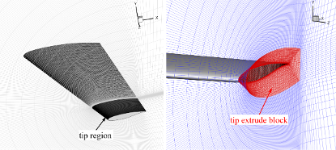

# Datasets for transonic wings

The dataset below are generated by Yunjia Yang on the HPC of Aerolab in Tsinghua University. Please contact Yunjia Yang (yyj980401@126.com) for the datasets.

## B-1. Wings / Kink wings with DPW-W1 profile

This dataset contains two parts, the single-sigment simple wings and two-sigment "kink" wings. This dataset is mainly to study the influence wing planform parameters on model training, so **the sectional airfoil of wings are fixed** to be the Wing I in the AIAA Darg Prediction Workshop III (DPW3). The maximum relative thickness and tail relative thickness are 0.135 and 0.0004, respectively. There are 846 simple wings and 164 kink wings.

Their operating conditions (incl. Angle of Attack and freestream Mach number) also vary.

The dataset has been used in:

**Citation:**

```text
Yang, Yunjia, Runze Li, Yufei Zhang, Lu Lu, and Haixin Chen. 2024. “Transferable Machine Learning Model for the Aerodynamic Prediction of Swept Wings.” Physics of Fluids 36 (7): 076105. https://doi.org/10.1063/5.0213830.
```

### Sampling

#### Geometries of simple wings

The single-segment swept wings are wings with the simplest planform geometries. A sketch diagram of the frontal, profile, and top views of a simple wing is depicted below. 


Its geometry is generated by linearly extruding the wing surface between the two control sectional airfoils on the tip and root. 

Five planform geometry parameters are used to describe the wing: the tapper ratio ($TR$), aspect ratio ($AR$), leading-edge sweep angle ($\Lambda_\text{LE}$), leading-edge dihedral angle ($\Gamma_\text{LE}$), and tip-to-root twist angle ($\alpha_\text{twist}$). The are defined as:

$$
TR = \frac{c_\text{tip}}{c_\text{root}}\\[10pt]
AR = \frac{b_{1/2}^2}{2S_{1/2}}
$$

Acting as the source domain of the transfer learning framework, the planform parameters of the wings in the simple wing dataset are sampled over a wide range of possible values as shown in Table. 
|Parameter	|Symbol	|lower bound	|upper bound|
|-|-|-|-|
|sweep angle	|$\Lambda_\text{LE}$	|0°	|35°|
|dihedral angle	|$\Gamma_\text{LE}$	|0°	|3°|
|aspect ratio	|$AR$	|6	|10|
|tapper ratio	|$TR$	|0.2	|1.0|
|twist angle	|$\alpha_\text{twist}$	|0°	|-6°|

The straight wing that is without sweep, dihedral, tapper, and twist is used for one side of the boundary, while the other side of the boundary is determined by experience according to the typical values such as the values of the DPW-W1. 


 

#### Geometries of the kink wings
In engineering applications, it is difficult for a single-segment wing to fulfill its aerodynamic and structural needs under multiple operating conditions, so a wing with a kink is always adopted as the planform geometry. The figure below shows the top view of a kink wing that has three control sectional airfoils on the tip, root, and kink. The kink wing can be seen as a concatenation of two simple wings that share the same leading-edge sweep and dihedral angle but have different tapper ratios and twist angles. 


The tapper ratios for the inner and outer segments are defined by $c_\text{kink}/c_\text{root}$ and $c_\text{tip}/c_\text{kink}$, and their twist angles are similarly defined by kink-to-root and tip-to-kink. $\eta_k$ is introduced to describe the spanwise location of the kink.
 
The kink wings are the target domain in the proposed transfer learning framework, so the ranges of the planform parameters in the dataset are decided based on typical values for commercial airliner’s wings. 

|Parameter	|Symbol	|lower bound	|upper bound|
|-|-|-|-|
|sweep angle	|$\Lambda_\text{LE}$	|25°	|35°|
|dihedral angle	|$\Gamma_\text{LE}$	|2°	|2°|
|aspect ratio	|$AR$	|7	|9|
|kink position	|$\eta_k$	|0.3	|0.4|
|tapper ratio of the inner segment	|$TR_\text{in}$	|0.5	|0.7|
|tapper ratio of the outer segment	|$TR_\text{out}$	|0.4	|0.6|
|twist angle of the inner segment	|$\alpha_\text{twist,in}$	|-2°	|-4°|
|twist angle of the outer segment	|$\alpha_\text{twist,out}$	|-2°	|-5°|
 


### Grid 

Grids were generated with `CGrid`.
- Sectional airfoil grid: 
    - Structured C-type grid solved with elliptic equation to ensure grid orthogonality
    - Grid size is 401×81 in the circumferential direction (i-direction) and wall-normal direction (j-direction). 
    - The grid contains 321 cells on the airfoil surface. The far-field location is 80 chords away from the airfoil. The height of the first mesh layer is 2.7e-6 chord.
    
- Wing grid:
    - Wing grid is obtained by linearly interpolate the sectional grid from tip to root
    - Spanwise grid has 61 points for simple wings; and 25 and 65 points for the inner and outer segments, respectively, for kink wings. The spanwise positions distributed more densely near the wing tip. 
    - Grid points near the wing tip are extruded outside to form another grid block, as marked in red in figure.
    
    - the outermost layer of the grid is extruded to the far field (30 chords away) with 41 grid points.
    - **Grid size**: 2.86 million (single wings), 3.66 million (kink wings).

### CFD

- Computed using the Reynolds Average Navier–Stokes (RANS) solver CFL3D. 
    - finite volume method
    - MUSCL scheme, ROE scheme
    - Gauss-Seidel algorithm
- Turbulance model: shear stress transport (SST) model
- Multigrid: three-level W-cycle multigrid: steps from coarse to fine 1000, 1000, and 6000
- convergence criteria: lift coefficient in the last 500 steps is lower than 0.0002

**final size: 846 for simple wings and 164 for kink wings**

### Data format

#### output surface flow field

| file name | `wing101.npy` |
|-|-|
| array size | Simple wing (846, 6, 321, 101) <br> Kink wing (164, 6, 321, 101) |
| dim. 1 | `x`,`y`, `z`, `Cp`, `Cft`, `Cfz` *|
| dim. 2 & 3 (flow field size) | 321 (around sectional airfoil) x 101 (spanwise**) |

\* all geometry variables are DIMENSIONAL. Coefficents are on mesh points. Surface friction distributions are decomposed by in x-y plane and z-direction as follow:
    

\*\* The values are linearly interpolated to a uniformly distributed series of z-position sections to unify the simple and kink wing data formats. The original data before interpolation can be found in `wingdata.npy`

#### input wing parameters

There are two version index files: global parameters and distributed parameters. Global parameters are original planform parameter and operating conditions. Distributed parameters are local position, chord length, and AOA values at every cross-section that need to be predicted. We demonstrated in [PoF 2024](https://doi.org/10.1063/5.0213830) distributed parameter inputs are better.

**Global parameter file**

| file name | Simple wing  `wingindex.npy` |
|-|-|
| array size | (846, 14) |
| 0  |  wing index  |
| 1  |  aoa  |
| 2  | Mach number |
|3| sweep angle|
|4| dihedral angle	|
|5| aspect ratio|
|6| tapper ratio|
|7| twist angle|
|8| tip-to-root thickness ratio ($=1$)|
|9| reference area |
|10| lift coeffcient *|
|11| drag coeffcient *|
|12| reconstructed lift coeffcient **|
|13| reconstructed drag coeffcient **|

| file name | Kink wing  `wingindex.npy` |
|-|-|
| array size | (164, 17) |
| 0  |  wing index  |
| 1  |  aoa  |
| 2  | Mach number |
|3| sweep angle|
|4| dihedral angle	|
|5| aspect ratio|
|6| kink position	|
|7| tapper ratio of the inner segment	|
|8| tapper ratio of the outer segment	|
|9| tip-to-root thickness ratio ($=1$)|
|10| twist angle of the inner segment	|
|11| twist angle of the outer segment	|
|12| reference area |
|13| lift coeffcient *|
|14| drag coeffcient *|
|15| reconstructed lift coeffcient **|
|16| reconstructed drag coeffcient **|

\* read from `clcd.dat` from CFL3D calculation
\*\* reconstructed from ground truth interpolated data ($\approx 1\%$ error from CFD values) -> ground truth for coefficients in model training

**Distributed input file**

| file name | `wing101deltaindex.npy` |
|-|-|
| array size | Simple wing (846, 101, 5) <br> Kink wing (164, 101, 5) |
| dim. 1 | spanwise index|
| dim. 2 | `xLE`, `yLE`, `zLE`, `chord`, `alpha` |

`xLE` to `zLE` stands for position of the leading edge point of the sectional airfoil, `chord` represents the section chord, and `alpha` represents the effective alpha = wing alpha + twist angle.


## B-2. Single Segment Wings 

This dataset contains single-sigment simple wings with different airfoil profile, planform parameter, and operating conditions (incl. Angle of Attack and freestream Mach number). The wing's cross-section profiles have the same CST parameters along spanwise, but the thickness is changed linearly. A total of 1842 wings are available now.

The dataset has been used in:

**Citation:**

```text

```
### Sampleing

#### sectional airfoil profile

The sectional airfoil are from dataset A-3, which contains 1420 airfoils with various performance. The maximum thickness of these airfoils are 0.08 ~ 0.14. Their thickness are transfered with swept theory according to swept angle when generating wings.


#### wing geometry

Each airfoil is used to construct two wings, and the wing planform parameters are randomly sampled from the range below:


|Parameter	|Symbol	|lower bound	|upper bound|
|-|-|-|-|
|sweep angle	|$\Lambda_\text{LE}$	|0°	|35°|
|dihedral angle	|$\Gamma_\text{LE}$	|0°	|3°|
|aspect ratio	|$AR$	|6	|10|
|tapper ratio	|$TR$	|0.2	|1.0|
|twist angle	|$\alpha_\text{twist}$	|0°	|-6°|
|tip-to-root thickness ratio| $r_t$ | 0.8 | 1.0 |


#### operating conditions

`AOA` from 1 deg. to 6 deg., `Mach` from 0.72 to 0.85, Reynold number is 6.43 million, freestream temperature is 580 R.

### Grids and CFD

Same to B-1

### Data formats

#### output surface flow field

| file name | `wing101.npy` |
|-|-|
| array size | (1842, 6, 321, 101)|
| dim. 1 | `x`,`y`, `z`, `Cp`, `Cft`, `Cfz` *|
| dim. 2 & 3 (flow field size) | 321 (around sectional airfoil) x 101 (spanwise**) |

\* \*\* same as B-1

#### input

**Global parameter file**

| file name | Simple wing  `wingindex.npy` |
|-|-|
| array size | (1842, 35) |
| 0  |  wing index  |
| 1  |  aoa  |
| 2  | Mach number |
|3| sweep angle|
|4| dihedral angle	|
|5| aspect ratio|
|6| tapper ratio|
|7| twist angle|
|8| tip-to-root thickness ratio ($=1$)|
|9| reference area |
|10| root relative thickness |
|11-20| CST coeffcients for upper surface |
|21-30| CST coeffcients for lower surface |
|31| lift coeffcient *|
|32| drag coeffcient *|
|33| reconstructed lift coeffcient **|
|34| reconstructed drag coeffcient **|

\* \*\* same as B-1

**Distributed input file (sectional parameters)**

Compared to B-1, distributed version geometry adds sectional airfoil profile to each cross section.

| file name | `wing101deltaindex.npy` |
|-|-|
| array size | Simple wing (1842, 101, 27)|
| dim. 1 | spanwise index|
| dim. 2 | `xLE`, `yLE`, `zLE`, `chord`, `alpha`, `thick`, `cstu`, `cstl`, `Ma` |

`xLE` to `zLE` stands for position of the leading edge point of the sectional airfoil, `chord` and `thick` represents the section chord and relative thickness. `alpha` represents the effective alpha = wing alpha + twist angle. `cstu` and `cstl` has 10 dimensions each, represent the CST parameters for the airfoil curves (in these dataset is the same). We also add a channel of `Ma` whose value is Mach number values every where.

**Distributed input file (mesh points)**

Another distributed version is to directly use the mesh points here, which is the first three channel of `wing101.npy`.

#### Auxilary files (for 2D prediction)

**Normalized wing sectional profiles**

The 2D model needs normalized (chord length to be 1 and no twist angle) sectional profiles of the wing sections to predict 2D flow field. Here we constructed a file that contains normalized airfoils.

| file name | `winggeom.npy` |
|-|-|
| array size | Simple wing (1842, 101, 3, 321) |
| dim. 1 | spanwise index|
| dim. 2 | `normx`, `normy`, `normz` |
| dim. 3 | index around airfoil |

**Sectional lift distribution**

The sectional lift coefficient of each cross-section is obtained with

$$
C_{L,\eta} = \frac{L}{0.5\rho u^2 c}
$$

where $L$ is the lift integrated from sectional pressure and friction distribution.

The sectional drag coefficient distribution can be defined similarly.

| file name | `wingcl101.npy` |
|-|-|
| array size | Simple wing (1842, 3, 101) |
| dim. 1 | `z`, `cl,eta`, `cd,eta` |
| dim. 2 | spanwise index|

The original mesh grid version (with 61 spanwise points) can be found in `wingcldistribution.npy`

