# FlowGen

[TOC]

FlowGen is a universal flowfield generator based on Auto-Encoder (AE) & Variational Auto-Encoder (VAE) and implentmented in Pytorch. It differs from other flowfield generators that it introduce **prior learning strategy** to enhance the predicting accuracy and transfer learning capability. The FlowGen has been applied to the prediction and optimization tasks such as the transonic buffet and the fluidic injection into the single expansion ramp nozzle (SERN).

**Author:** 

Yunjia Yang, Tsinghua University, yyj980401@126.com
Runze Li, lirunze16@tsinghua.org.cn

**Contributor (former user):** 

- Zuwei Tan (Supersonic 2D inlet)
- Gongyan Liu (Temperature field of a data center)
- Jiazhe Li (Supersonic 2D single expansion ramp nozzle)

**Citation:**

Yunjia Yang, Runze Li, Yufei Zhang, and Haixin Chen*. 2022. “Flowfield Prediction of Airfoil Off-Design Conditions Based on a Modified Variational Autoencoder.” AIAA Journal 60 (10): 5805–20. https://doi.org/10.2514/1.J061972.

# Datasets

The dataset below are generated by Runze Li from Tsinghua University. Later Yunjia Yang rearranged them to dataset (under the format introduced in below section). They are available under reasonable requests. Please contact Yunjia Yang (yyj980401@126.com) for the datasets.

**Citation:**

Runze, LI, Yufei Zhang, and Haixin Chen*. 2022. "Pressure distribution feature-oriented sampling for statistical analysis of supercritical airfoil aerodynamics". Chinese Journal of Aeronautics, 35 (4): 14.

## 1. Supercritical Airfoil Flowfield Dataset

This dataset contains 1498 supercritical airfoils with same maximum thickness. For each airfoil, the flowfield under 11 lift coefficients (from 0.6 to 1.0) and Ma = 0.76 are obtained.

The dataset has been used in:

- Yunjia Yang, Runze Li, Yufei Zhang, and Haixin Chen*. 2022. “Flowfield Prediction of Airfoil Off-Design Conditions Based on a Modified Variational Autoencoder.” AIAA Journal 60 (10): 5805–20. https://doi.org/10.2514/1.J061972.

### Sampling

- Maximum relative thickness = 0.095 
- Sampled with the output space sampling (OSS) method in the space of 14 CST parameters. The purpose of sampling is to obtain airfoil geometries with abundant upper-surface pressure profile 
- Constrianed with Other engineering constraints
    - leading-edge radius is larger than 0.007
    - the cruise point drag coefficient does not exceed 0.1 
- A total of 1498 samples are obtained in the sampling process


### Grid 

- Structured C-type grid solved with elliptic equation to ensure grid orthogonality
- Grid size is 381×81 in the circumferential direction (i-direction) and wall-normal direction (j-direction). 
- The grid contains 300 cells on the airfoil surface. The far-field location is 80 chords away from the airfoil. The height of the first mesh layer is 2.7e-6 chord.

### CFD

- Computed using the Reynolds Average Navier–Stokes (RANS) solver CFL3D. 
    - finite volume method
    - MUSCL scheme, ROE scheme
    - Gauss-Seidel algorithm
- Turbulance model: shear stress transport (SST) model

### Data format

The infomation of flowfield data are below:

| | |
|-|-|
| array size | (16478, 6, 331, 75) |
| channel name | `x`,`y`, `p`, `T`, `u`, `v` *|
| flowfield size | 331 x 75 **|

\* all flowfield variables are NON-DIMENSIONAL with freestream condition (in CFL3D's way); values are on mesh points.


\*\* The index of the flowfield is shown below


### Data format

The infomation of index data are below:

| array size | (16478, 10) |
|-|-|
| channel 0  |  airfoil index  |
| channel 1  |  condition index  |
| channel 2  |  ref index for the airfoil|
| channel 3  |  aoa |
| channel 4  |  ref aoa  |
| channel 5  |    ref ma  |
| channel 6  |  ref cl  |
| channel 7  |  cl  |
| channel 8  |  cd  |
| channel 9  |  running idx |


# Motivations

During aerodynamic shape optimization (ASO), it is usually not enough to only optimize the **design point performance** since it may cause undesired performance losses at **off-design points**. Therefore, an important task of ASO is to fast and accurately predict a series of flowfields and their aerodynamic performances. 

The compuatational fluid dynamic (CFD) method is usually used to obtain such a series of flowfield, yet it leads to large compuation cost and may not be a wise choise during ASO which needs each sample to be evaluated fast. Thus, we can leverage the capability of the deep nerual network (DNN) and construct a DNN-based surrogate model to calculate the massive off-design flowfields.

In order to improve the prediction accuracy, the FlowGen is designed to predict a series of off-design flowfields with a **prior flowfield** as reference. The advantages are two-folded.


## Introducing the *Prior*

Normally, the design point and off-design points flowfields have strong relationships. It is because that the variation of the flowfield with the design parameters (i.e., the freestream Mach number) is continuous and the flow structures maintain the same. 

Therefore, **introducing the design flowfield as the input** (in the statistic perspective, as the *prior*) **when generating the off-design flowfields should improve model's perfromance**.

## Residual learning

Another motivation to introducing design flowfield when predicing off-design flowfield is from the common understand of the deep neural network. Since the ResNet, people has know that DNN is easier to learn a 0 - 0 mapping than a non-zero identical learning. In another word, the model's performance can be improved by subtracing the same part. 

Therefore, there's an option in FlowGen to make the model predicting the **difference** (or the residual) **between the target flowfield** (in most time, the off-design flowfield) **and the prior flowfield** (the design flowfield). 

# Setup

This section introduces how to set up and run the prediction model.

## Installation

You can either fork the code or download the latest .zip to your working folder.

Then, open the command at the working folde and install the `FlowGen` with:

```powershell
python setup.py install
```

If you want to make some modification to the code, use 

```powershell
python setup.py develop
```

## Dataset establishment

The first thing to do before training is to establish a dataset. The dataset is slightly different from the ordinary one, a **series dataset**.

This means we have a database of many different prior flowfields 

$$\mathcal S_\text{prior}=\{r_{f}\}_{f=1,2,\cdots,N_f}$$

(for example, the flowfield under design cruise condition of many different airfoils: $foil_1, foil_2, \cdots, foil_{N_f}$ ). 

Meanwhile, in order to train the model supervised, for each prior flowfield $f$, we also need many target flowfields. 

$$\mathcal S_\text{target}=\{x_{c,f}\}_{f=1,2,\cdots,N_f;~c=1,2,\cdots N_c(f)}$$

(for example, the flowfield of each airfoil under many different operating conditions (AoA) $c_1, c_2, \cdots, c_{N_c(f)}$.) 

The complete database can be written as:

$$\mathcal{S}=\left\{r_f,\left\{x_{c, f}\right\}_{c=1,2, \cdots N_c(f)}\right\}_{f=1,2, \cdots, N_f}$$

where the flowfields for the same $f$ is called one **series**, or one group.

> Notice that the last subscript $N_c$ is a function of $f$, which means the number can be different for different airfoils. 

### Prepare data

The data should be stored in two `.npy` files in advance. (there are some examples in section `flowfield dataset`).

#### data

The first data file contains the flowfields, which should be named `data<yourname>.npy`, where `<yourname>` can be replaced to any legal string. Its shape should be 

$$ (N_\text{prior flowfields} + N_\text{target flowfields}) \times N_\text{channel} \times H [\times W ]$$

- The first dimension is the total number of the prior and target flowfields. 

- The second dimension is the number of channels. In flowfield reconstructing tasks, each channel can represent a mesh coordinate (i.e., x, y) or flow variables (i.e., p, T, u, v).

- The third dimension and the rest dimensions are for each flowfield. If the input data is a profile (like a pressure profile on the airfoil surface), then it should be only the third dimension. If the input data is a field, then there should be the third and the fourth dimension.

#### index

The first data file contains the index information of the flowfields, which should be named `index<yourname>.npy`, where `<yourname>` is the same as in `data<yourname>.npy`. Its shape should be 

$$ (N_\text{prior flowfields} + N_\text{target flowfields}) \times N_\text{info} $$

For each flowfield, $N_\text{info}$ values can be stored. They should obey the format below:

|index|note|description|
|-|-|-|
|0| $i_f$|Index of the prior flowfield|
|1| $i_c$|Index of the current flowfield's condition among its series|
|2||Index of the prior flowfield's condition among its series |
|3 ~ 3+DC| $c$ | The condition values of the current flowfield (The length of this part depends on the dimension of a condition code)|
|4+DC~4+2DC| | The condition values of the prior flowfield of its series (The length of this part depends on the dimension of a condition code)|
|more| |Auxilary data|

### Import dataset with `ConditionDataset`

The dataset should be constructed before training with the following code:

```python
from FlowGen.dataset import ConditionDataset as Cd

fldata = Cd(file_name='<yourname>', d_c=1, c_mtd='all', n_c=None, c_map=None, c_no=1, test=100, data_base='data/', is_last_test=True, channel_take=None)
```

> **Remark for saving the index**
> Sometimes we need to save the list of which flowfields we have chosen for training. 
>The `ConditionDataset` is designed to do so: when `c_mtd` is other than `'load'`, an index list will be saved in the `data_base` folder with the name `<yourname>_<c_no>dataindex.txt`. So next time when you want to use this index map, simply use `c_mtd='load'` and assign the desired `c_no`.

The arguments of the `ConditionDataset` is:

|argument|type|description|
|-|-|-|
|`file_name`|`str`| name of the data file||
|`d_c`| `int` | dimension of the condition values|
|`c_mtd`|`str`| for each series, sometimes we want to choose *some* of it for training. This argument decides how to choose the conditions used in training<br/>- `fix` :   by the index in `c_map`<br/>-`random`: randomly select `n_c` conditions when initializing the dataset<br/>- `all`:    all the conditions will be used to training<br/>- `exrf`:   except the index of prior flowfield conditions<br/>- `load`:   load the selection method by the file number `c_no` (use `save_data_idx(c_no)` to save)|
|`n_c`|`int`| **Default:** `None` <br/> (`c_map` = `random`) <br/> number of the condition of one airfoil should the dataset give out
|`c_map`| `List` | **Default:** `None` <br/> (`c_map` = `fix`) <br/>fix index number
|`c_no`| `int` | **Default:** `-1` <br/> (`c_map` = `load`) <br/>  number of saved data index
|`test`| `int` | **Default:** `-1` <br/>  the amount of data not involved in training
|`is_last_test` | `bool` | **Default:** `True` <br/> if true, the last samples will be used as test samples; if false, randomly selected
|`data_base` | `str` | **Default:** `'\data'` <br/> the folder path of `data.npy` and `index.npy`
|`channel_take` | `List` | **Default:** `None` <br/> if not None, the assigned channels will be used for training, while the others are left


### Several useful functions of `ConditionDataset`

During training, the `ConditionDataset` act like the origin `Dataset` in Pytorch. There are several extra functions you may interested in for post-process or other circumstances:

**`get_series`**

```python
fldata.get_series(idx, ref_idx=None)
```
**function:** Return the whole series flowfield of the assigned series index ( $i_f$ ).

**arguments:**: 

- `idx`: `int` the series index ( $i_f$ )

**return:** `Dict` with `{'flowfields': flowfield, 'condis': condis, 'ref': ref, 'ref_aoa': ref_aoa}`

- `'flowfield'`: `np.ndarray` (size: $N_c(f) \times C \times H \times W$), the flowfields of the assigned series 
- `'condis'`:  `np.ndarray` (size: $N_c(f) \times D_c$) , the operating condition values of the assigned series 
- `'ref'`: `np.ndarray` (size: $C \times H \times W$), the prior flowfields of the assigned series 
- `'ref_aoa'`:  `np.ndarray` (size: $D_c$), the operating condition values of the prior flowfield in the assigned series 

**`get_index_info`**

```python
fldata.get_index_info(i_f, i_c, i_idx)
```
**function:** Return the value in a specific position in `index.npy`.

**arguments:**: 

- `i_f`: `int` the series index ( $i_f$ )
- `i_c`: `int` the condition index in the series ( $i_c$ )
- `i_idx`: `int` the index of the information vector

**return:** the value 

## Construct the model

The backbone of the FlowGen is the Encoder-Decoder model or its variational version, VAE. To predict a series of off-design flowfields, the operating condition for the target flowfield needs to be introduced. The model can be divided into three procedures as shown in the figure: 


- The **Encoder** extracts *latent variables* (also can be seen as the statistic features) from the input prior flowfield.

- The **Concatenetor** combines the *latent variables* (only related to the prior flowfield) and the *operating condition* of the target flowfield. There are several strategies to do the above combination, both deterministic and stochastic, and will be introduced in the sections below.

- The **Decoder** takes the concatenated vector as input, and generates the target flowfield.

### Set the encoder and decoder

To construct the model, we first need to assign the proper encoder and decoder:

```python
from FlowGen.base_model import convEncoder_Unet, convDecoder_Unet

_encoder = convEncoder_Unet(in_channels=2, last_size=[5], hidden_dims=[64, 128, 256])
_decoder = convDecoder_Unet(out_channels=1, last_size=[5], hidden_dims=[256, 128, 64, 64], sizes = [24, 100, 401], encoder_hidden_dims=[256, 128, 64, 2])
```
The table below shows the available encoder and decoder classes.

| Type | Encoder | Decoder | 
|--|--|--|
| base class| `Encoder` | `Decoder` | 
| dense connected | `mlpEncoder` | `mlpDecoder` | 
| convolution (1D/2D) | `convEncoder` | `convDecoder` | 
| Unet convolution (1D/2D) | `convEncoder_Unet` | `convDecoder_Unet` | 
| ResNet | `Resnet18Encoder` | `Resnet18Decoder` | 

For more details on the encoder and decoder, please see [here](#encoder--decoder)

### Set the model

Then we can construct the predicting model with the assigned encoder and decoder. This is done by constructing a `frameVAE` or `Unet` class. They are arguments of them are the same, like:

```python
vae_model =  frameVAE(latent_dim=12, encoder=_encoder, decoder=_decoder, code_mode='ved1', dataset_size=None, decoder_input_layer=0, code_dim=1, code_layer=[], device = 'cuda:0')
```

The arguments of the `frameVAE` and `Unet` are:

|argument|type|description|
|-|-|-|
|`latent_dim`| `int` |   the total dimension of the latent variable (include code dimension)
|`encoder`| | the encoder
|`decoder`| | the decoder
|`code_mode`| `str` | the mode to introduce condition codes in the concatenator. See the table below.
|`code_dim`| `int` | **Default**  `1`<br/> the condition code dimension (same as that in the dataset)
|`device`|| **Default**  `cuda:0`<br/> training device
|`dataset_size`| `Tuple` | **Default** `None`<br/> (`code_mode` = `'im'`, `'semi'`, `'ex'`, `'ae'`)<br/> the size to initial the prior latent variable storage. The size should be ($N_f$, $N_c$)
|`decoder_input_layer`| `float` | **Default**  `0`<br/> the amount of dense connect layers between latent variable `z` and the decoder input, see [Decoder input layers](#decoder-input-layers)|
|`code_layer`|`List`|**Default**  `[]`<br/> (`code_mode` = `'semi'`, `'ex'`, `'ae'`, `'ed'`, `ved`, `ved1`)<br/> The layers between the real condition code input and where it is concatenated to the latent variables, see [Coder input layers](#code-input-layers)

The available concatenator mode can be found in the following table, see [Concatenetion strategy](#concatenetion-strategy) for details.

|perspective|probabilistic|implicit|semi-implicit|explicit|none|
|-|-|-|-|-|-|
|ae|d.||||`ae`|
|ae|vf.|`im`|`semi`|`ex`||
|ed|d.||||`ed`|
|ed|v.||||`ved`|
|ed|vf.||||`ved1`|

ae = auto-encoder perspective, ed = encoder-decoder perspective
d. = deterministic, v. = variational, vf. = only variational with flow features

## Training

### Set operator

To train the model, we need another class, the operator `AEOperator`, to conduct the training process:

```python
op = AEOperate(opt_name='<new>', model=vae_model,  dataset=fldata,
                recon_type='field',
                input_channels=(None, None),
                recon_channels=(1, None),
                num_epochs=300, batch_size=8, 
                split_train_ratio=0.9,
                recover_split=None,
                output_folder="save", 
                shuffle=True, ref=False,
                init_lr=0.01)
```

The arguments of the `AEOperator` are:

|argument|type|description|
|--|-|-|
|`opt_name` | `str` |  name of the problem
|`model` | `frameVAE` | the model to be trained
|`dataset` | `ConditionDataset` | The dataset to train the model|
|**Save & Load**
|`output_folder`|`str`|**Default**  `'save'`<br/> The path to set up a new folder called `opt_name` and save the checkpoints
|**Training**
|`init_lr`|`float`|**Default**  `'0.01'`<br/> The initial learning rate
|`num_epoch`|`int`|**Default**  `'300'`<br/> The maximum number of training epoch
|**Dataset**
|`split_train_ratio`|`float`|**Default**  `0.9`<br/> The ratio of the training dataset, the rest will be the validation dataset. The latter is not involved in the training but is monitored to avoid over-fitting. Notice that the test dataset is split when constructing the `ConditionDataset`.
|`recover_split`|`str`|**Default**  `None`<br/> Whether to recover the split of the dataset (train and validation dataset). If it is `None`, the dataset will be randomly split with the `split_train_ratio`, and the split result will be saved in `'<output_folder>/<optname>/dataset_indice'`. If it is not, the split will be recovered from `'<output_folder>/<recover_split>/dataset_indice'`<br/> 
|`batch_size` | `int` | **Default**  `8`<br/>  The mini-batch size (argument for `torch.utils.data.DataLoader`)|
|`shuffle | `bool` | **Default**  `True`<br/>  Whether to shuffle the dataset when training (argument for `torch.utils.data.DataLoader`)|
|**Model**
|`ref`|`bool`|**Default**  `False`<br/> Whether to use the *residual learning* strategy, i.e., to use the residual value of the operating condition, and to reconstruct the residual field
|`input_cahnnels`|`Tuple[int, int]`| **Default**  `(None, None)`<br/> The lower and upper range of the channels to input to the model. If the range is `None`, means on this direction there is no interception. <br/> *Remark.* The channel number should match the `in_channels` of the encoder
|`recon_cahnnels`|`Tuple[int, int]`| **Default**  `(1, None)`<br/> The lower and upper range of the channels that are to be compared with the output of the model. If the range is `None`, means on this direction there is no interception.<br/> *Remark.* The channel number should match the `out_channels` of the decoder
|`recon_type`| `str` | **Default**  `'field'`<br/> 

### Set loss parameters

Then, we also need to set some parameters for the loss calculation. There are several loss terms involved in the training process. They are [basic loss terms]((#reconstruction-index-and-code-loss)) (include the reconstruction, code, and index loss) and the [physics-based loss terms](#physics-based-loss) (include the NS loss and the aerodynamic loss). 

When using different code concatenate modes, the involved basic loss terms are not the same and are concluded in the following table.

|loss term| `im`| `semi`|`ex`|`ae`|`ed`|`ved`|`ved1`|
|-|-|-|-|-|-|-|-|
|reconstruction|√|√|√|√|√|√|√|
|index|KL-p|KL-p|KL-p|MSE-p||KL-n|KL-n|
|code|MSE|MSE|||||

- **KL-p**:  Kullback-Leibler divergence (KL divergence) to the prior latent variables $z_r$. 
- **MSE-p**:  Mean square error to the prior latent variables $z_r$. 
- **KL-n**：  KL divergence to the standard normal distribution $\mathcal N(0,1)$.

The physics-based loss terms can be added as you want. It is only related to the reconstructed flowfield.

To manipulate the loss parameters, you can use the following sentence:

```python
op.set_lossparas()
```

All of the parameters have default values, so only need to put the parameters you want to change into the arguments. The arguments related to the code and index loss are:

|key | type | default | description|
|-|-|-|-|
|`code_weight`| `float` | `0.1`| the weight of code loss, better for 0.1         
|`indx_weight`| `float` | `0.0001`| the weight of index KLD loss  
|`indx_epoch`| `int` | `10`| the epoch to start counting the index KLD loss 
|`indx_pivot`| `int` | ` -1`| the method to get avg_latent value <br/> - if it is a positive number, use the latent value of that condition index <br/> - if `-1`, use the averaged value of all condition index

The arguments related to the physics-based loss are:

|key | type | default | description|
|-|-|-|-|
|`sm_mode`|`str`|`'NS'`|the mode to calculate smooth loss<br/>   - `NS`:     use navier-stokes equation's conservation of mass and moment to calculate smooth<br/>   - `NS_r`    use the residual between mass/moment flux of reconstructed and ground truth as loss<br/>   - `offset`  offset diag. the field for several distances and sum the difference between the field before and after move\n<br/>   - `1d`      one-dimensional data (adapted from Runze)
|`sm_epoch`| `int` | `1` | the epoch to start counting the smooth loss 
|`sm_weight`| `float` | `0.001`| the weight of the smooth loss
|`sm_offset`| `int` | `2 `| (`sm_epoch`=`offset`) the diag. direction move offset
|`moment_weight`| `float` | `0.0 `| (`sm_epoch`= `NS`, `NS_r`) the weight of momentum flux residual
|`aero_weight ` | `float` | `1e-5`| the weight of aerodynamic loss
|`aero_epoch` | `int` | `299`| the epoch to start counting the aero loss 

### Set the optimizer and scheduler

Then we need to set the optimizer and the scheduler to train the model. They are based on `torch.optim`, and assigned to the operator as follows:

```python
op.set_optimizer(<optimizer_name>, <keyword arguments of the optimizer>)
op.set_scheduler(<scheduler_name>, <keyword arguments of the scheduler>)
```

Both the `set_optimizer` and `set_scheduler` have the first argument to be the *Class name* in `torch.optim` and `torch.optim.lr_scheduler`. Then the rest arguments should be the keyword arguments of the assigned optimizer and scheduler. Here is an example:

```python
op.set_optimizer('Adam', lr=0.01)
op.set_scheduler('ReduceLROnPlateau', mode='min', factor=0.1, patience=5)
```

**Recommended setting**

The optimizer is default set to `'Adam'` with the `init_lr` assigned when initializing the `AEOperator`. If you want to change the optimizer, set it explicitly after constructing the `AEOperator`.

The scheduler is recommended to use the warmup strategy. It first increases the learning rate from a smaller value, and then reduces it. The FlowGen provides two warming-up strategies in `FlowGen.utils`

1. Warmup with exponent

    ```python
    from FlowGen.utils import warmup_lr

    op.set_scheduler('LambdaLR', lr_lambda=warmup_lr)
    ```
    
    $$\mathrm{LR} = \mathrm{LR}_\text{init} \times \left\{\begin{array}{lc} 1+0.5 \times \text { epoch, } & \text { epoch }<20 \\ 10 \times 0.95^{\text {epoch-20, }}, & \text { epoch }\ge 20 \end{array}\right.$$

2. Warmup with plateau

    ```python
    from FlowGen.utils import warmup_plr_lr

    op.set_scheduler('LambdaLR', lr_lambda=warmup_plr_lr)
    ```
    
    $$\mathrm{LR} = \mathrm{LR}_\text{init} \times \left\{\begin{array}{ll} 1+0.5 \times \text { epoch, } & \text { epoch }<20 \\ 10 , & 20 \le \text { epoch }\le 50  \\ 1  , & 50 \le \text { epoch }\le 100 \\ 0.1 , & 100 \le \text { epoch }\le 150 \\ 0.01 , & 150 \le \text { epoch }\le 200 \\ 0.001 , & 200 \le \text { epoch }\le 250 \\ 0.0001 , & 250 \le \text { epoch }\end{array}\right.$$

### Train the model

To train a model, use:

```python
op.train_model(save_check=100, save_best=True, v_tqdm=True)  
```

The arguments

- `save_check`: (int) the interval between the checkpoint file is saved to the given path `output_path`
- `save_best`: (bool) **default**: `True` whether to save the best model

- `v_tqdm`: (bool) **default**: `True` whether to use `tqdm` to display progress. When writing the IO to files, `tqdm` may lead to fault.

## Post process

After the model is trained, the FlowGen provides several useful functions to post-process the reconstructed flowfield data. Most of them aim to obtain the aerodynamic coefficients of the surfaces in the flowfield.

### Use the model to predict

First, we need to call the model to predict the flowfield of the new airfoil and/or under new operating conditions. This can be done with the `encode` and `sample` functions in the `frameVAE` class. The `encode` is used to obtain the latent variables (`mu` and `log_var`) from the new prior flowfield, and the `sample` generate the new flowfield with the given operating condition (`code`), and the latent variables. Here is an example:

```python
#* construct the prior flowfield and prior condition
aoa_ref = torch,from_numpy(np.array([1.0])) # prior condition is 1.0
data_ref = torch.from_numpy(np.concatenate(geom, field_ref), axis=0) # prior flowfield
data_ref = data_ref.float().unsqueeze(0).to(device) # add the batch channel and move to device

#* use the encoder to obtain latent variables (or its distribution)
mu, log_var = vae_model.encode(data_r)

#* generate the airfoil's new profiles under other operating conditions with the model
for aoa in aoas:
    aoa_residual = aoa - aoa_ref # get residual operating conditions
    field_residual = vae_model.sample(num_samples=1, code=aoa_residual, mu=mu, log_var=log_var) # sample the latent variables and get the residual field
    field_reconstruct = field_residual + field_ref

```

There are some remarks to the above code:

1. The function `encode` takes the batch version of the input. So don't forget to add the batch channel with `unsqueeze(0)` if the input don't have that channel.
2. During prediction, no matter what the concatenation strategy is, the decoder only need the latent varialbes of the prior field. So `mu` and `log_var` can obtained in advance, and no need for update during the prediction of one airfoil.
3. The `vae_model.sample` is automatically adaptive to the concatenation strategy. It means that:
    - if the strategy is stochmatic, several latent variables will be sampled from the distribution of the l.v. and be input to the decoder, and each of the latent variables will lead to a result reconstruct field. This gives a way to evaluate the uncertainty of the reconstruct field. The number of the samples can be assigned by `num_sample`.
    - if the strategy is deterministic, no sampling process takes place, and the argument `log_var` will be ignored. It is also no need to assign a `num_sample` greater than one.
4. The Unet decoder needs feature maps from the encoder, but the batch dimension of the feature maps (usually is 1) may be different from the decoder (equals `num_sample`). The FlowGen provide a function to multiplize the encoder's feature map: `vae_model.repeat_feature_maps(num_sample)`

### Calculate aerodynamic coefficients from the reconstruct fields

There are some functions to obtain the angle of attack, lift, and drag from a 2D flowfield. They are listed in the table below:

|name|description|arguments|returns|
|-|-|-|-|
|`get_aoa(vel)`|extract the angle of attack(AoA) from the far-field velocity field| - `vel`:   the velocity field, shape: (2 x H x W), the two channels should be U and V (x and y direction velocity) <br/> Only the field at the front and far-field is used to average.|(`torch.Tensor`): the angle of attack
|`get_p_line(X, P, i0=15, i1=316)`|extract pressure values at the airfoil surface from the pressure field `P`. The surface p-value is obtained by averaging the four corner values on each first-layer grid.| - `X`:    The X field, shape: (H x W)<br/> - `P`:    The P field, shape: (H x W)<br/> - `i0` and `i1`:  The position of the start and end grid number of the airfoil surface | Tuple(`torch.Tensor`, `List`):  `X`, `P` (shape of each: (i1-i0, ))|
|`get_vector(X: Tensor, Y: Tensor, i0: int, i1: int)` | get the geometry variables on the airfoil surface <br/> **Remark:** should only run once at the beginning, since is very slow | - `X`:    The X field, shape: (H x W) <br/> - `Y`:    The Y field, shape: (H x W) <br/> - `i0` and `i1`:  The position of the start and end grid number of the airfoil surface | `torch.Tensor, torch.Tensor, torch.Tensor`: <br/> `_vec_sl`, `_veclen`, `_area` <br/> - `_vec_sl`:  shape : `(i1-i0-1, 2)`, the surface section vector `(x2-x1, y2-y1)` <br/> - `_veclen`:  shape : `(i1-i0-1, )`, the length of the surface section vector <br/> - `area`:     shape : `(i1-i0-1, )`, the area of the first layer grid (used to calculate tau)
|`get_force_xy(vec_sl: Tensor, veclen: Tensor, area: Tensor, vel: Tensor, T: Tensor, P: Tensor, i0: int, i1: int, paras: dict, ptype: str = 'Cp')`| integrate the force on x and y direction| - `_vec_sl`, `_veclen`, `_area`: obtained by `_get_vector` <br/> - `vel`:   the velocity field, shape: (2 x H x W), the two channels should be U and V (x and y direction velocity)<br/> - `T`:    The temperature field, shape: (H x W)<br/> - `P`:    The pressure field, shape: (H x W); should be non_dimensional pressure field by CFL3D <br/> - `i0` and `i1`:  The position of the start and end grid number of the airfoil surface<br/> - `paras`:    the work condtion to non-dimensionalize; should include the key of (`gamma`, `Minf`, `Tinf`, `Re`)| `Tensor`: (Fx, Fy) The x and y direction force
|`get_force_cl(aoa: float, <same parameter as get_force_xy>)` | get the lift and drag | `aoa`:  angle of attack  <br/> - The rest parameters are the same with `get_force_xy` |`Tensor`: (CD, CL) The drag coefficients and the lift coefficients

There are some functions to obtain the x,y direction force from a 1D pressure profile. They are listed in the table below:

|name|description|arguments|returns|
|-|-|-|-|
|`get_xyforce_1d(geom: Tensor, profile: Tensor)` | integrate the force on x and y direction | - `geom`:    The geometry (x, y), shape: (2, N)  <br/> - `profile`: The pressure profile, shape: (N, ). It should be non_dimensional pressure profile by freestream condition:  <br/> $$Cp = \frac{p - p_\text{inf}}{0.5\rho u^2} $$ | `Tensor` (Fx, Fy)|
| `get_force_1d(geom: Tensor, profile: Tensor, aoa: float)` | integrate the lift and drag| - `geom`:    The geometry (x, y), shape: (2, N) <br/> - `profile`: The non-dimension pressure profile, shape: (N, ), same as in `get_xyforce_1d` <br/> - `aoa`:  angle of attack | `Tensor` (CD, CL)|
|`get_flux_1d(geom: Tensor, pressure: Tensor, xvel: Tensor, yvel: Tensor, rho: Tensor)` | obtain the mass and momentum flux through a line | - `geom`:    The geometry (x, y), shape: (2, N)  <br/> `pressure`: The pressure on every line points, shape: (N, ); should be *dimensional* pressure profile  <br/> `xvel`: x-direction velocity on every line points, shape: (N, )  <br/> `yvel`: y-direction velocity on every line points, shape: (N, )  <br/> `rho`: density on every line points, shape: (N, ) | `Tensor` (mass_flux, moment_flux)|

To speed up calculation for series data, it has a batch version, where the input and output both add the first channel for batch size.
|origin name|batch version name|
|-|-|
|`get_force_1d`|`get_force_1dc`|
|`get_xyforce_1d`|`get_xyforce_1dc`|

# Model details


## Encoder & Decoder

There are several options of the Encoder & Decoder according to the flowfield being dealt with. They are implemented in `base_model.py` and with the framework of `torch.nn.Module`.

When using, the encoder and decoder should be defined explicitly before defining an `AEOperator`. For example:

```python
from FlowGen.base_model import convEncoder_Unet, convDecoder_Unet

_encoder = convEncoder_Unet(in_channels=2, last_size=[5], hidden_dims=[64, 128, 256])
_decoder = convDecoder_Unet(out_channels=1, last_size=[5], hidden_dims=[256, 128, 64, 64], sizes = (24, 100, 401), encoder_hidden_dims=[256, 128, 64, 2])
```
The table below shows the available encoder and decoder.

| Type | Encoder | Decoder | 
|--|--|--|
| base class| `Encoder` | `Decoder` | 
| dense connected | `mlpEncoder` | `mlpDecoder` | 
| convolution (1D/2D) | `convEncoder` | `convDecoder` | 
| Unet convolution (1D/2D) | `convEncoder_Unet` | `convDecoder_Unet` | 
| ResNet | `Resnet18Encoder` | `Resnet18Decoder` |  

### Densely connected network

The most simple network for encoder and decoder. It consists of several dense connected hidden layers between the input and output. 

> **Remark:** The flowfield has spacial correlations. The densely connected network ignores such correlations because it takes the adjusted points in flowfields/profiles separately. Therefore, it is recommended to use convolutional networks to capture the correlations and reduce the size of trainable parameters.

#### `mlpEncoder`

The encoder is defined by:

```python
_encoder = mlpEncoder(in_channels=802, hidden_dims=[256, 128, 64])
```

- `hidden_dims`: (`List` of `int`)
The dimensions of each hidden layer are defined with the argument `hidden_dims`. The length of the `hidden_dims` is the amount of the hidden dimension.

- `in_channels`: (`int`)
The input dimension of the first hidden layer. No matter the dimension of the input prior flowfield (1D or 2D), it will be flattened to one dimension before input to the encoder, so the `in_channels` for the `mlpEncoder` should be the flatten one. 

#### `mlpDecoder`

The encoder and decoder are defined by:

```python
_decoder = mlpDecoder(in_channels=12, out_sizes=[401], hidden_dims=[64, 128, 256])
```

- `hidden_dims`: (`List` of `int`)
The dimensions of each hidden layer are defined with the arguments `hidden_dims`. The length of the `hidden_dims` is the amount of the hidden dimension.

- `in_channels`: (`int`)
The input dimension of the first hidden layer. It equals the latent dimension for the `mlpDecoder`. 

- `out_sizes`: (`List` of `int`)
The original size of the decoder's output. The decoder's output is resized to it in order to match the input size.

### Convolution network (1D or 2D)

One-dimensional convolution (1D conv) and two-dimensional convolution neural networks are promising solutions when dealing with 1D profiles (i.e., the pressure profiles on the airfoil) and 2D flowfields. They work mostly the same and can be found in every deep neural network textbook. The input to the 1D / 2D CNN can also have several channels, where each channel represents a flow variable (i.e., p, T, u, v).

#### `convEncoder`

The encoder consists of several encoder blocks. Each of the blocks contains a 1D / 2D convolutional layer (`nn.Conv1d` or `nn.Conv2d`), an activation layer (For default, we use the `nn.LeakyReLU`. It can be changed by assigning `basic_layers['actv'] = nn.ReLU`). 

The following figure shows the sketch of a 1D convolutional encoder. The 2D convolutional encoder is mostly the same, except that the feature maps are two-dimensional.

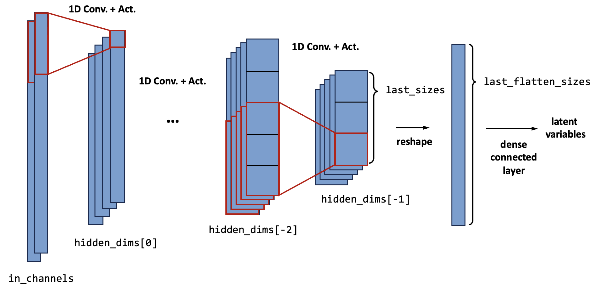

For each block, several hyper-parameters are needed, they are:
- channel size (`hidden_dims[i]`)
- kernel size (`kernel_sizes[i]`), stride (`strides[i]`), and padding (`paddings[i]`). For 1D, they are `int`; for 2D, `int` means they are the same for height and width direction, `tuple` means they are different.
- if there is an average pool layer, additional pool kernel size (`pool_kernels[i]`) and pool stride (`pool_strides[i]`) are needed.

The amount of blocks is given by the length of `hidden_dims`, and the dimensions of each hidden feature map is $B_i \times C_i \times H_i (\times W_i)$, where:
- $B_i$ is the size of the mini-batch
- $C_i$ is the channel size, given by the argument `hidden_dim[i]`
- $H_i (\times W_i)$ is the size of the feature map. It can be 1D or 2D. They are given by the parameters of the convolution kernel as follows:
$$H_i = \frac{H_{i-1} - k + 2 p}{s} + 1$$
$$W_i = \frac{W_{i-1} - k + 2 p}{s} + 1$$
where $k$ is the kernal size (`kernel_sizes[i]`), $s$ is the stride (`strides[i]`), and $p$ is the padding (`paddings[i]`).

If necessary, there can also be pooling layers in every or some of the blocks. The default type of the pooling layer is the average pool layer (`nn.AvgPool1d` or `nn.AvgPool2d`). (It can also be changed by assigning `basic_layers['pool'] = nn.MaxPool1d` or `basic_layers['pool'] = nn.MaxPool2d`)

The feature maps after the pooling layers can be derived by

$$H_{i'} =  \frac{H_{i} - k_p + 2 p_p}{s_p} + 1$$

Also if necessary, there can be batch normalization layers in every block. This can be done by assigning `basic_layers['bn'] = nn.BatchNorm1d` or `basic_layers['pool'] = nn.BatchNorm2d`. Here we code to put the batch normalization layers between the convolutional layers and the activation layers. Some research shows that locating the BN layers after the activation layers may lead to better performances, but we didn't find too many benefits.


**Arguments**

The encoder is defined by:

```python
_encoder = convEncoder(in_channels=2, last_size=[5], hidden_dims=[64, 128, 256], dimension=1)
```

- `in_channels`: (`int`)
    
    The size of channels of the profiles input to the encoder. Each channel can represent a flow variable (i.e., x, y, p, T, u, v)

- `last_size`: (`List` of `int`)
    
    The size of the feature map that is closest to the latent variables (for the encoder is the last feature map). Notice that the list does not contain the channel size.

- `hidden_dims`: (`List` of `int`)
    
    The channel size of the feature maps. The length of the `hidden_dims` determines the number of encoder blocks.

- `kernel_sizes`[**Default:** `3` for each block]: (`List` of `int`)
    
    The kernel sizes of each block. (see above)

- `strides` [**Default:** `2` for each block]: (`List` of `int`)
    
    The strides of each block. (see above)

- `pool_kernels` [**Default:** `3` for each block]: (`List` of `int`)
    
    The kernel sizes of the average pool layer of each block. (see above) **Remark:** If `pool_kernels[i] <= 0`, there will not be the average pool layer for block i.

- `pool_strides` [**Default:** `2` for each block]: (`List` of `int`)
    
    The strides of the average pool layer of each block. (see above)

- `dimension` [**Default:** `1`]: (`int`)
    
    The dimension of input and output feature maps. If 1D, the convolution, batch normalization, and pooling layers are all 1D. For 2D they are 2D.

- `basic_layers` [**Default:** see below]: (`Dict`)
    
    Basic layers to construct the encoder. The table below shows the fundamental layers and their default values. If onewantst to change the default one, the value for the corresponding key should be input to the encoder with the `Class` object.

    |key|1D|2D|
    |--|--|--|
    |`'conv'`|`nn.Conv1d`|`nn.Conv2d`|
    |`'actv'`|`nn.LeakyReLU`|`nn.LeakyReLU`|
    |`'pool'`|`nn.AvgPool1d`|`nn.AvgPool2d`|
    |`'bn'`|`None`|`None`|

#### `convDecoder`

The decoder also consists of several blocks. Each of the blocks realizes upscaling with three layers. First, a linear (for 1D) or bilinear (for 2D) interpolation layer (`F.interpolate`) expands the feature map to a given size `sizes[i]`. 

Then, a 1D / 2D convolutional layer is applied to modify the interpolation results. The size of the feature map is maintained the same for the convolutional layer, so the stride of the convolution kernel is 1, and the padding is given by $p = (k - 1) / 2$, where $k$ should be an odd number.

The last is the activation layer. Like the encoder, the default is an `nn.LeakyReLU` layer, and can be changed by assigning `basic_layers['actv']`. The batch normalization layer is also available if needed, by assigning `basic_layers['bn']`.

The upscaling process can also be done with `nn.ConvTranspose2d` for example, but they are not implemented in the FlowGen.

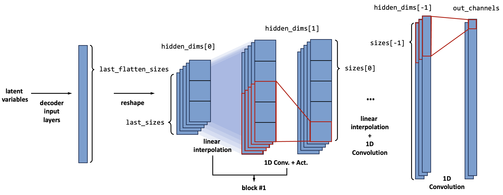

For each block, the channel size ( $C$ ) is given by `hidden_dims[i]`. The feature map ( $H (\times W)$ ) size is explicitly given by argument `sizes[i]`. For 1D cases, the `size[i]` should be an `int`, and for 2D cases, the `size[i]` should be a `List` containing two `int` (for $H$ and $W$).

**Arguments**

The decoder is defined by:

```python
_decoder = convDecoder(out_channels=1, last_size=[5], hidden_dims=[256, 512, 256, 128], sizes = [24, 100, 401], dimension=1)
```

- `out_channels`: (`int`)
    
    The size of channels of the decoder's output. It is not always the same as `in_channels`, because usually, we input the geometry channels as well as the flow variables to the encoder, but only want the decoder to reconstruct the flow variables.

- `last_size`: (`List` of `int`)
    
    The size of the feature map that is closest to the latent variables (for the decoder is the size input to the first decoder block). Notice that the list does not contain the channel size.

- `hidden_dims`: (`List` of `int`)
    
    The channel size of the feature maps. The length of the `hidden_dims` determines the number of decoder blocks.

- `sizes`: (`List` of `int`)
    
    The sizes of each feature map. (see above)

- `basic_layers` [**Default:** see below]: (`Dict`)
    
    Basic layers to construct the decoder. The table below shows the fundamental layers and their default values. If onewantst to change the default one, the value for the corresponding key should be input to the encoder with the `Class` object.

    |key|1D|2D|
    |--|--|--|
    |`'conv'`|`nn.Conv1d`|`nn.Conv2d`|
    |`'actv'`|`nn.LeakyReLU`|`nn.LeakyReLU`|
    |`'deconv'`|`base_model.IntpConv1d`|`base_model.IntpConv2d`|
    |`'bn'`|`None`|`None`|

### Convolutional U-Net (1D or 2D)

#### `convEncoder_Unet` & `convDecoder_Unet`

U-Net is a new model framework based on the Encoder-Decoder network for better model performances. The major consideration of the U-Net is to introduce the feature maps along the encoder to the corresponding decoder part. [Ref. Ronneberger (2015)]

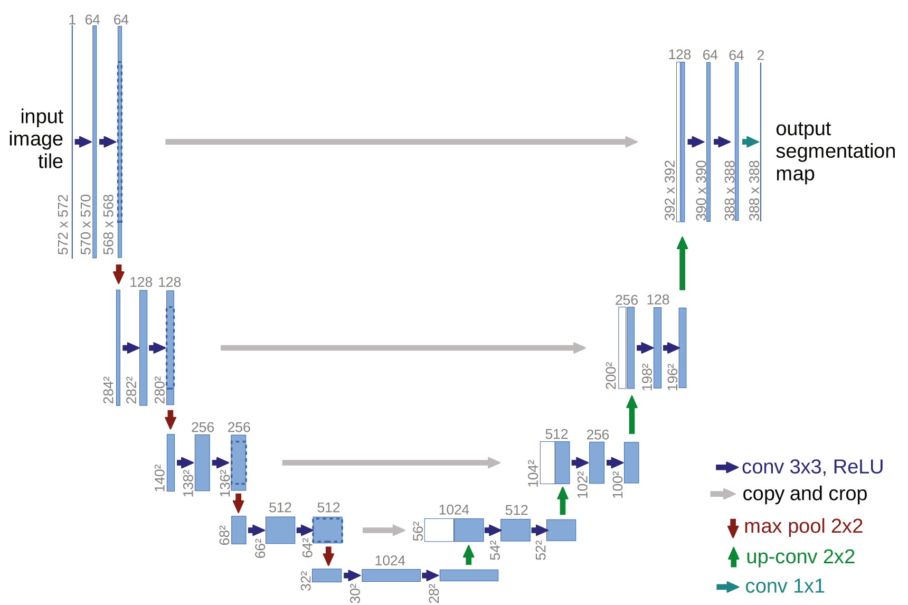

The U-Net improves model prediction performances in a way like the ResNet: introducing direct identical links (skip connection) to avoid gradient diminishing. Meanwhile, it won't increase the parameter size of the model, and will only raise a little training time cost. It is recommended to use U-Net version 1D-conv network by default.

The U-Net in FlowGen is implemented with separate classes `convEncoder_Unet` and `convDecoder_Unet`. They inherit the vanilla `convEncoder` and `convDecoder`. 

The encoder and decoder are defined by:

```python
_encoder = convEncoder_Unet(in_channels=2, last_size=[5], hidden_dims=[64, 128, 256], dimension=1)
_decoder = convDecoder_Unet(out_channels=1, last_size=[5], hidden_dims=[256, 128, 64, 64],sizes = [24, 100, 401], dimension=1, encoder_hidden_dims=[256, 128, 64, 2]) 
```

The arguments of the U-Net version are mostly the same as the vanilla one, while there is one extra argument for the `convDecoder_Unet`:

- `encoder_hidden_dims` [Only `convDecoder_Unet`]: (`List` of `int`)
The channel dimension of the encoder's hidden layers. It should be a list of "reverse of the encoder's `hidden_dims`" and "encoder's `in_channel`".

### ResNet

ResNet is a popular CV backbone network [Ref. He (2016)]. It is simple, but its performance is outstanding. It improves model predicting performances by adding skip connections (shortcuts) between layers to avoid gradient diminishing. Here, the ResNet is invoked to construct the encoder and decoder.

#### Residual block

The minimum unit of the ResNet is **Residual Block (RB)** which implements the skip connection. Its structure is depicted in the following figure.

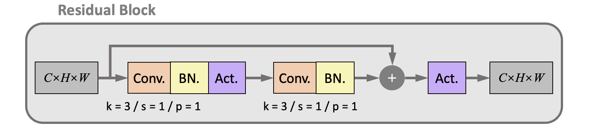

There are two connection paths between the input and output feature maps:

The lower is the **main path**, consisting of two groups of the 2D convolutional layers. The kernel parameters of the convolutional layers are fixed to kernel size ( $k$ ) = 3, stride ( $s$ ) = 1, and padding( $p$ ) = 1. Therefore, the size of the output feature map is the same as the input. The upper is a **shortcut path** which directly connects the input and output feature maps, ensuring the propagation of the value and gradients.

There are also batch normalization layers and activation layers after each convolutional layer. Due to the BN layer, the `bias` is shut down in the convolutional layer. 

> **Pre-activation strategy:** Research shows that the BN layer and activation can be moved to in front of the convolutional layer to improve performances. It leads to the *pre-activation* version of the residual block, as shown in the figure.
> 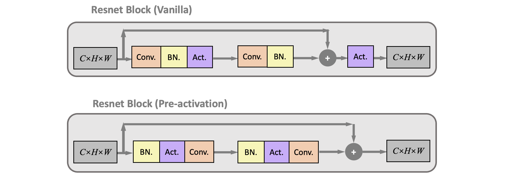
> The FlowGen supports the pre-activation version by setting the argument `preactive = True`. Yet, it didn't show much improvement in the test cases.

#### Residual block for down-sampling and up-sampling

The residual blocks also need to up-sample and down-sample the feature maps. This is done by the **down-sampling residual block (RBDS)** and **up-sampling residual block (RBUS)**, whose structures are shown in the following figure:

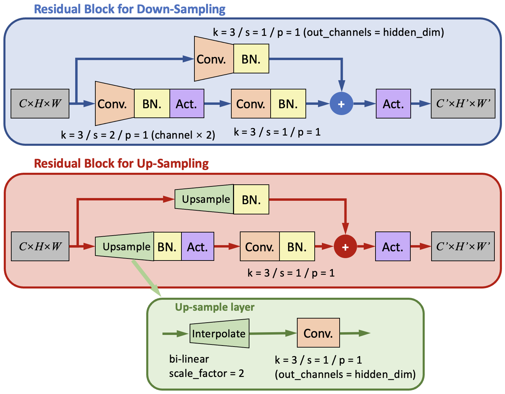

There are still two paths in the RBDS and RBUS. In order to change the size of the output feature maps, the kernel parameters for the first convolutional layer are modified. 

For the RBDS, it is modified to a kernel with kernel size ( $k$ ) = 3, <u>stride ( $s$ ) = 2 </u>, and padding( $p$ ) = 1. Meanwhile, the number of channels is increased to the given `hidden_dims[i]` to maintain the conservation of information flux.

For RBUS, the first convolutional layer is replaced with an up-sample layer that is similar to what we used in the `convDecoder`. It contains a bilinear (for 2D) interpolation layer (`F.interpolate`) with `scale_factor = 2` to double the height and width of the feature map; and a 2D convolutional layer with kernel size = 3, stride = 1, and padding = 1. The convolution layer also reduces the number of channels to the given `hidden_dims[i]`.

> **Interpolation layer:**  The interpolate layer is implemented with the class `IntpConv`. It has one-dimensional version `IntpConv1d` and two-dimensional version `IntpConv2d`. They all use `F.interpolate` to up-sampling and down-sampling the feature map into the given sizes. The `F.interpolate` has two modes: assign the `size` or assign the `scale_factor`. When the `scale_factor` is assigned, the output size will be calculated with 
> $$H'=[scale\_factor_0 \times H]\\ W'=[scale\_factor_1 \times W]$$

#### `Resnet18Encoder`

The residual blocks are combined to form the encoder and decoder. The following figure depicts the framework of the ResNet encoder. 

The encoder is constructed with several groups, where each group consists of an RBDS and several RBs. 

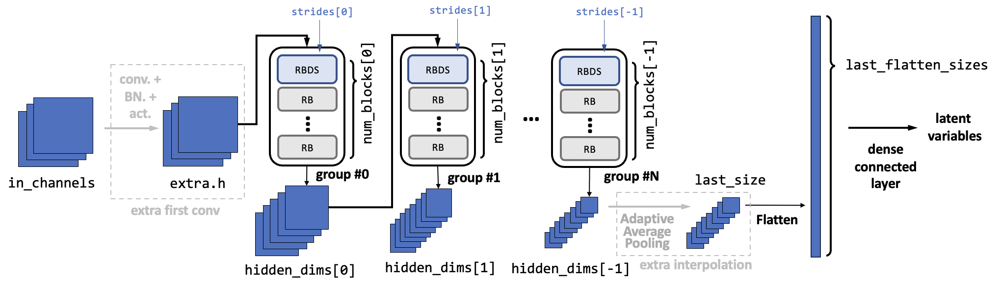

In each group, the input feature maps first go through the RBDS. Inside the RBDS, the feature map's size is reduced with the given `strides[i]` (normally it is 3, so the size will be halved). Meanwhile, the channel number is increased to the given `hidden_dims[i]`. Then the feature maps go through several RBs. The amount of RBs is `num_blocks[i] - 1`. Inside the RBs, the feature map sizes and channel number remains the same. The amount of groups is determined by the length of the `hidden_dims`. 

Before the residual block groups, an optional convolutional layer (called the `extra_first_conv`) can be added to manipulate the input channel number to a desired one. It is done by assigning the argument `extra_first_conv` to a `Tuple` with four elements: (output hidden dimension, kernel size, stride, padding).

After the residual block groups, the feature map size should be the same as assigned in `last_size`. If the `force_last_size` is set to `True`, an additional adaptive average pooling layer is applied to modify the size to a given one. Else, there will be an error raised if the `last_size` mismatch the real output size.

**Arguments**

The encoder is defined by:

```python
_encoder = Resnet18Encoder(in_channels=6, last_size: [11, 3], hidden_dims = [16, 32, 64, 128, 256], num_blocks = None, strides = None,  extra_first_conv = None, force_last_size = False)
```

- `in_channels`: (`int`)
    
    The size of channels of the profiles input to the encoder. Each channel can represent a flow variable (i.e., x, y, p, T, u, v)

- `last_size`: (`List` of `int`)
    
    The size of the feature map that is closest to the latent variables (for the encoder is the last feature map). Notice that the list does not contain the channel size.

- `hidden_dims`: (`List` of `int`)
    
    The channel size of the feature maps for each residual block group (after every RBDS). The length of the `hidden_dims` determines the number of encoder groups.

- `num_blocks`[**Default:** `2` for each group]: (`List` of `int`)
    
    The number of residual blocks (including the RBDS and RB) of each group. Then there will be one RBDS and (`num_block` - 1) RBs in that group. Every element in the list should >= 2.

- `strides` [**Default:** `2` for each group]: (`List` of `int`)
    
    The strides of each convolutional layer in the RBDS block in every group.

- `extra_first_conv` [**Default:** `None`]: (`Tuple` of `int`)
    
    The parameters of the extra first convolutional layer. If one wants to manipulate the input channel number to a desired one. If it is not a `None`, then the tuple should contain four elements, where No.1 is the desired new channel amount, No.2 is the kernel size, No.3 is the stride, and No.4 is the padding.

- `force_last_size` [**Default:** `False`]: (`bool`)

    Whether to addadditional layerss after the residual block groups in order to force the output feature map into the given `last_size`.

- `basic_layers` [**Default:** see below]: (`Dict`)
    
    Basic layers to construct the encoder. The table below shows the fundamental layers and their default values. If one want to change the default one, the value for the corresponding key should be input to the encoder with the `Class` object.

    |key|default|comment|
    |--|--|--|
    |`'preactive'`|`False`|whether to switch on the pre-active version (see above)|
    |`'actv'`|`nn.LeakyReLU`||

#### `Resnet18Decoder`

The ResNet decoder is similar to the encoder. The input latent vector is first to reshape to feature maps with assigned `last_size`. Then they will go through several groups, where each group consists of an RBUS and several RBs. 

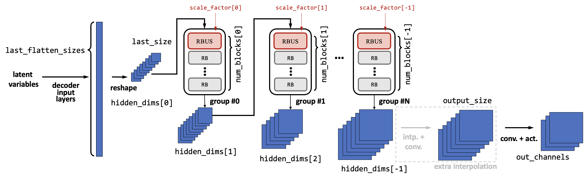

In each group, the input feature maps first go through the RBUS. Inside the RBUS, the feature map's size is increased with the given `scale_factor[i]` (should be greater than 1, and normally it is 2, so the size will be doubled). Meanwhile, the channel number is decreased to the given `hidden_dims[i+1]`. Then the feature maps go through several RBs. The amount of RBs is `num_blocks[i] - 1`. Inside the RBs, the feature map sizes and channel number remains the same. The amount of groups is determined by the length of the `hidden_dims`. 

After the residual block groups, the feature map size can be manipulated to a given output size if the argument `output_size` is given. If so, an additional interpolation layer (same as the up-sampling layer in the RBDS) is applied to modify the size to the given one. 

**Arguments**

The decoder is defined by:

```python
_decoder = Resnet18Decoder(out_channels=4, last_size=[11, 3], hidden_dims=[256, 128, 64, 32, 16], num_blocks=None, scales=None, output_size=None, basic_layers=None)
```

- `out_channels`: (`int`)
    
    The size of channels of the decoder's output. It is not always the same as `in_channels`, because usually, we input the geometry channels as well as the flow variables to the encoder, but only want the decoder to reconstruct the flow variables.

- `last_size`: (`List` of `int`)
    
    The size of the feature map that is closest to the latent variables (for the decoder is the size input to the first decoder block). Notice that the list does not contain the channel size.

- `hidden_dims`: (`List` of `int`)
    
    The channel size of the feature maps for each residual block group (after every RBUS). The length of the `hidden_dims` determines the number of decoder groups.

- `num_blocks`[**Default:** `2` for each group]: (`List` of `int`)
    
    The number of residual blocks (including the RBUS and RB) of each group. Then there will be one RBUS and (`num_block` - 1) RBs in that group. Every element in the list should >= 2.

- `scales` [**Default:** `2` for each group]: (`List` of `float`)
    
    The scale factor of each interpolation layer in the RBUS block in every group.

- `output_size` [**Default:** `None`]: (`List` of `int`)

    If this argument is assigned for a value other than `None`, additional layers will be added after the residual block groups in order to force the output feature map into the given `output_size`.

- `basic_layers` [**Default:** see below]: (`Dict`)
    
    Basic layers to construct the encoder. The table below shows the fundamental layers and their default values. If onewantst to change the default one, the value for the corresponding key should be input to the encoder with the `Class` object.

    |key|default|comment|
    |--|--|--|
    |`'preactive'`|`False`|whether to switch on the pre-active version (see above)|
    |`'actv'`|`nn.LeakyReLU`||
    |`'last_actv'`|`None`|the activation layer after the last convolutional layer (`self.fl`). For many cases, the output values on each grid is not between [0,1], so the default is not to use activation layers here.|

## Concatenetor

The concatenetor's target is to combine the **latent variables** extracted from the encoder with the **operating conditions**. There are several solutions, and there are selected through the arguments when constructing the object of the model class (`frameVAE` or `Unet`)

### Concatenation strategy

Generally speaking, there are two kinds of concatenation strategies. The difference between these two strategies is majorly in the training process. Let's consider that we are training a model to predict the flowfield of an arbitrary airfoil under an arbitrary angle of attack (AoA). The prior input is this airfoil's flowfield under the cruising angle of attack (AoAc). 

Before training, we should have a "series" database (the database will be introduced in the Pre-process section). This means we have a database of many different airfoils ( $foil_1, foil_2, \cdots, foil_{N_f}$ ), and for each airfoil $f$, we have many flowfields of this airfoil under many different operating conditions (AoA) $c_1, c_2, \cdots, c_{N_c(f)}$. Notice that the last subscript $N_c$ is a function of $f$, which means the number can be different for different airfoils. Then, each flowfield in the database can be written as 

$$\mathcal S_\text{off-design}=\{x_{c,f}\}_{f=1,2,\cdots,N_f;~c=1,2,\cdots N_c(f)}$$

Meanwhile, for each airfoil $f$, we also have a prior flowfield, which is the flowfield of the database under design AoA:

$$\mathcal S_\text{design}=\{r_{f}\}_{f=1,2,\cdots,N_f}$$

The model needs to construct the following mapping from training:

$$ \mathcal F: (r_f, c) \mapsto x_{c,f}~~\forall c, f$$

Split the mapping above into the encoder $\mathcal E$ and the decoder $\mathcal D$:

$$ \mathcal E: r_f \mapsto z_{f} \quad \forall f \qquad \mathcal D: (z_f, c) \mapsto x_{c,f}\quad \forall c,z_f $$

Then, during training, we will have two strategies to utilize the flowfield in the database:

#### Auto-encoder perspective

From the principles of the auto-encoder, the model's target is to **reconstruct** the input flowfield. From this perspective, the model can be seen as a dimension reduction tool, to extract low-dimensional representation (latent variables) $z$ from the flowfield.

However, during prediction, the input of the model can only be the reference (prior) flowfield $r_f$, and the target is to predict the flowfield $x_{c,f}$ under any operating condition $c$. Therefore, we need some more constraints during training, i.e, to force $\mathcal F(r_f, c) \rightarrow \mathcal F(x_{c,f}, c), \quad \forall c,f$

In order to reach this, we split the latent variables into two parts: the code part $z_c$ for operating condition and the flow feature part $z_f$. The following figure gives a rough description of the model. The encoder extracts the flow feature part from both the design and off-design flowfields. Then they are combined with the code part to form the complete latent variable $z$ and input to the decoder.

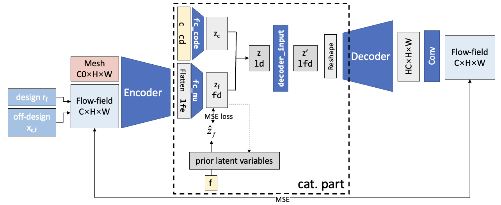

Now, we only need to ensure that the flow feature part latent variable (generated by the encoder) fulfills $\mathcal E(x_{c,f}) \rightarrow \mathcal E(r_f), \quad \forall c,f$. In other words, the $z_f$ for the off-design variable should be the same as the design variable (the prior latent variables). For simplicity, we note it as $z_f \rightarrow z_{r}$. This is realized by adding additional loss terms (code loss) into the training process, as the `MSE loss` in the figure.

However, during training, the flowfields are input to the model in random mini-batches, so we can't ensure the flowfields for one airfoil are in the same mini-batch. Thus, we can't ensure obtaining the up-to-date $z_r=\mathcal E(r_f)$ during training. To solve this problem, we proposed an **iterative training algorithm**: the prior latent variables $z_r$ are obtained after one epoch with the current encoder. The algorithm is illustrated below:

> 1. Initial the prior latent variables $z_r$ for each airfoil
> 2. for epoch = 1, ..., $N_\text{epoch}$ 
>> 3. for flowfield $x_{c,f}$ and $r_f$(ok with mini-batch)
>>> 4. get latent variable $z_f = \mathcal E(x_{c,f})$
>>> 5. get reconstruct flowfield $ x'_{c,f} = \mathcal D(z_f,c)$
>>> 6. get loss $l=\mathcal L_1(x_{c,f}, \hat x_{c,f})+\mathcal L_2(z_{f}, z_{r})+\cdots$
>>> 7. back-propagation and update model trainable parameters
>>> 8. return to 4. if there remain flowfields
>> 9. update prior latent variables: $z_r = \mathcal E(r_f)$
>> 10. return to 3. if not convergent

In the above figure, the latent variables are deterministic. They can also be stochastic, which means the $z_f$ is be seen as a normal distribution $z_f \sim \mathcal N(\mu_f, \sigma_f)$, and the encoder is to predict the distribution parameters $\mu_f, \sigma_f$ instead of predicting the $z_f$. For the decoder, the reparameterization trick is applied to sample from the distribution and give a reconstructed flowfield. 

Also, the way to deal with the operating conditions can also be different. Here we just put the real operating condition into the decoder and it is not put into the encoder part. Sometimes we want the encoder also takes the OC information when dealing with off-design flowfields. This led to several types of the concatenation part as shown below:

- Implicit: the encoder predicts the $z_c$, and another code loss is added to implicitly force the code given by the encoder to match the real code.
- Semi-implicit: the encoder predict the $z_c$, and code loss is added. But the real code instead of the predicted code is input to the decoder.
- Explicit: the encoder doesn't predict the $z_c$, and the real code is input to the last encoder layer, while it is also input to the decoder.
- None: the real code has no relation with the encoder.

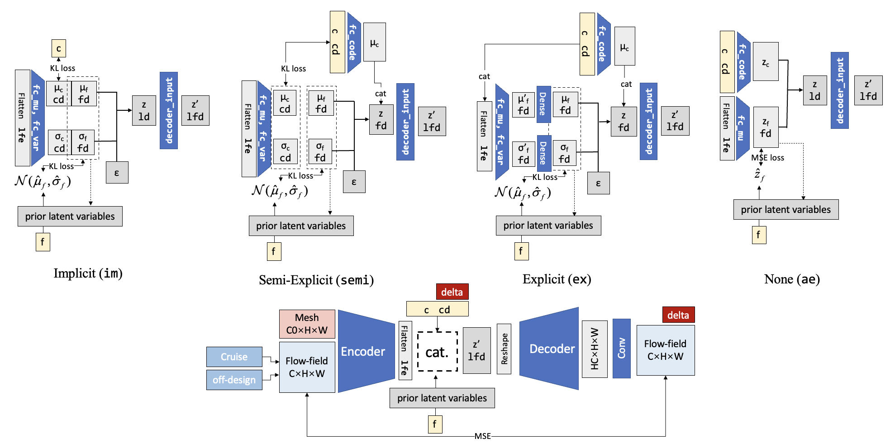

The advantage of the auto-encoder perspective is it has a clear theory basis (especially when using the Bayesian theory). The theoretical analysis can be found in the reference papers. The disadvantage is that it performs far worth than the encoder-decoder perspective below.

#### Encoder-decoder perspective

The difference of the encoder-decoder perspective is that it takes the encoder and decoder separately, and it does not require the identity of the output and input flowfield. So the target of the encoder-decoder model is to **generate** the off-design flowfield with whatever input. The input can be the mesh only (this is what most flowfield generators do), and can be the prior flowfield.

The following figure gives a rough description of the model. The encoder extract flow features $z_f$ from only off-design flowfields. Then they are combined with the code part $z_c$ to form the complete latent variable $z$ and input to the decoder.

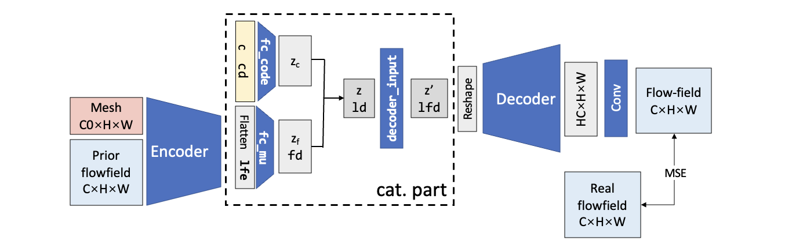

We shall notice that the $z_f$ is naturally the same for the same airfoil, so this time we don't need to add the additional loss term to ensure the flow feature part of the latent variables. The iterative training algorithm is also of no use. 

There is also variation version of the model, which is depicted in the following figure:

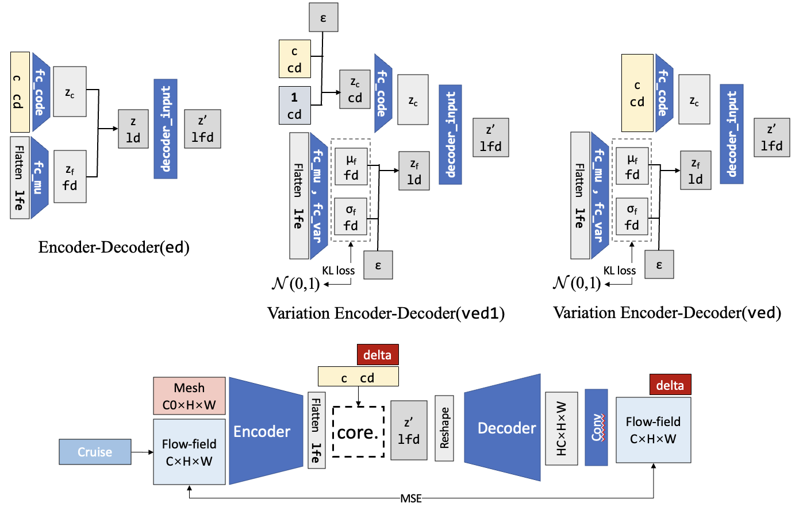

### Extra layers

There are some extra layers in the concatenation part to bridge different hidden dimensions and to improve the  performances. These extra layers can be changed according to needs.

#### Decoder input layers

Extra layers can be added between the concatenated latent variables $z$ and the input of the decoder. This is initially to bridge the different dimensions of the latent variables (`ld` = $D_{z_c} + D_{z_f}$) and the dimension needed for the decoder (`lfd` = `decoder.last_flatten_size`). This can be done with one dense connected layer. Increasing the number of the decoder input layers may have some benefits, but experiments show that there won't be many benefits.

The avilable decoder input layers are shown in below, it is assigned `decoder_input_layer` with a `int` to `frameVAE`.

|`decoder_input_layer`|layers|description|
|-|-|-|
|`0`|`nn.Identity()`|Default for densely connected decoder `mlpDecoder`, because the input dimension of the `mlpDecoder` is usually assigned as the dimension of the latent variables ($D_{z_c} + D_{z_f}$), so there is no need to bridge the difference.
|`1`| `nn.Linear(ld, lfd)`| Default for other decoder. Use a single linear layer to bridge the difference in different dimensions.|
|`2`| `nn.Linear(ld, ld*2)`, `nn.BatchNorm1d(ld*2)`, `nn.LeakyReLU()`, `nn.Linear(ld*2, lfd)`, `nn.BatchNorm1d(lfd)`, `nn.LeakyReLU()`|
| `2.5` | `nn.Linear(ld, ld)`, `nn.BatchNorm1d(ld)`, `nn.LeakyReLU()`, `nn.Linear(ld, lfd)`, `nn.BatchNorm1d(lfd)`, `nn.LeakyReLU()`|
|`3`|`nn.Linear(ld, ld)`, `nn.BatchNorm1d(ld)`, `nn.LeakyReLU()`, `nn.Linear(ld, ld*2)`, `nn.BatchNorm1d(ld*2)`, `nn.LeakyReLU()`, `nn.Linear(ld*2, lfd)`, `nn.BatchNorm1d(lfd)`, `nn.LeakyReLU()`|

#### Code input layers

Extra layers can also be added between the input condition code ( $c$, dimension = $D_c$ ) and the latent variable for the code ($z_c$, dimension = $D_{z_c}$). The purpose is to simulate the correlation among different elements of the condition code.

To construct the code input layers, you may assign the argument `code_layer` with a `List` containing a sequential of `int` numbers. Then a multi-layer neural network will be constructed, and each `int` number represents a densely connected layer with such hidden dimension. 

For example, `code_layer=[20, 30]` represents a code input layer of

```python
nn.Linear(code_dim, 20)
nn.LeakyReLU()
nn.Linear(20, 30)
nn.LeakyReLU()
```

## Loss terms

### Reconstruction, index, and code loss

The basic loss terms include reconstruction, code, and index loss. When using different code concatenate modes, the involved loss terms are not the same and are concluded in the following table.

|loss term| `im`| `semi`|`ex`|`ae`|`ed`|`ved`|`ved1`|
|-|-|-|-|-|-|-|-|
|reconstruction|√|√|√|√|√|√|√|
|index|KL-p|KL-p|KL-p|MSE-p||KL-n|KL-n|
|code|√|√|

The reconstruction loss is universal for all modes and is given by

$$\mathcal L_\text{reconstruct} = \frac 12 ||x-\hat x||^2$$

The code loss is used for the mode that needs to implicitly force the code generated by the encoder to be the same as the real code. It is given by 

$$\mathcal L_\text{code} = \frac 12 ||\mu_c-c||^2$$

The index loss is a bit complex. It is used to control the flow-feature part latent variables $z_f$ to satisfy restrictions. For different concatenate modes, the restrictions are different:

- **KL-p**:  Kullback-Leibler divergence (KL divergence) to the prior latent variables $z_r$. This kind of index loss is applied to `im`, `semi`, and `ex`, in order to force the distribution $z_f \rightarrow z_r$. Suppose they both obey the normal distribution, then we have:

    $$\mathcal L_\text{index} = KL\left(\mathcal N(\mu_f, \sigma_f), \mathcal N(\mu_r, \sigma_r)\right) =-\frac 12 \sum_{j=1}^J \left[ \log \frac{\sigma_{1,j}^2}{\sigma_{2,j}^2} - \frac{\sigma_{1,j}^2}{\sigma_{2,j}^2} - \frac{(\mu_{1,j}-\mu_{2,j})^2}{\sigma_{2,j}^2} +1 \right]$$

- **MSE-p**:  Mean square error to the prior latent variables $z_r$. This kind of index loss is applied to `ae`, in order to force the deterministic $z_f \rightarrow z_r$. Suppose they both obey the normal distribution, then we have:

    $$\mathcal L_\text{index} = MSE\left(\mathcal z_f, z_r\right) =\frac 12 ||z_f-z_r||^2$$

- **KL-n**：  KL divergence to the standard normal distribution $\mathcal N(0,1)$. This can be seen as the original version of the variance operation. It is applied to `ved` and `ved1`, to give a stochastic version of the encoder-decoder's latent variables. The flow-feature latent variables that the encoder extracts from the prior flowfield are seen as a normal distribution, and the KL loss will force it to the standard normal distribution:

    $$\mathcal L_\text{index} = KL\left(\mathcal N(\mu_f, \sigma_f), \mathcal N(0, 1) \right) =-\frac{1}{2} \sum_{j=1}^{J}\left(1+\log \sigma_j^{2}-\sigma_{j}^{2}-\mu_{j}^{2}\right)$$

### Physics-based loss

Loss terms based on flow physics may provide more information to the model when training and help avoid overfitting when using a limited dataset, which may improve the model’s generalization ability. In this paper, two loss terms are proposed.

The flowfield near the airfoil is expected to be more crucial than other parts of the flowfield, since the elements near the airfoil primarily determine the performance of the airfoil. The aerodynamic forces, including the lift coefficient, $C_L$, and drag coefficient, $C_D$, are calculated by integrating the pressure force and shear stress around the wall boundary; therefore, these coefficients are selected to guide the model to focus more on the flow near the wall by adding their prediction error to the loss function. Consequently, the loss term of aerodynamic forces is expected to guide the model to better predict the flowfields of new airfoils.

In the training and testing process, the coefficients are extracted from the flowfield data by an in-house post-process program. The non-dimensional forces are first obtained on each grid cell of the first layer next to the airfoil surface and then summed to get the lift and drag coefficients.

The predicted lift and drag coefficients obtained from the reconstructed flowfield are denoted as $\hat C_L$ and $\hat C_D$ . The coefficients computed from CFD are $C_L$ and $C_D$. The lift coefficients range from 0.6 to 1.0 and the drag coefficients range 0.003 from 0.083. Since these values are not close to zero, the aerodynamic loss term is defined as:

$$\mathcal{L}_{\text {Aero }}=\left(\frac{\left|\hat{C}_L-C_L\right|}{C_L}+\frac{\left|\hat{C}_D-C_D\right|}{C_D}\right)$$

Conservation of mass, momentum, and energy are fundamental physical laws that apply to fluid flow. Since the calculation of momentum and energy losses involves information on the turbulence fields, which are not predicted by the model, only mass conservation loss is considered in this paper. 

The mass flux is calculated cell by cell for each reconstructed flowfield and is minimized by adding a corresponding term to the loss function. In the framework of the finite volume solver, the flow variables are stored at the cell center. The flow variables are interpolated from the cell center to the grid edge to calculate the mass flux, as shown in the figure.

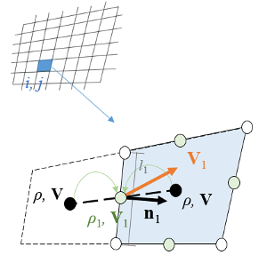

Then, the mass flux of the grid cell can be calculated as 

$$\Phi_{\mathrm{m}, i j}=\sum_{k=1}^4 \rho_k\left(\mathbf{V}_k \cdot \mathbf{n}_k\right) l_k$$

where the density, $\rho$, can be calculated based on the pressure and temperature of the cell. Finally, the mass residual is compared with the residual of the CFD result and the positive deltas are counted for the loss function of the model:

$$\mathcal L_\text{Mass} =\Phi_{\mathrm{m}}=\max \left(0, \sum_{i j} \Phi_{\mathrm{m}, i j}-\Phi_{\mathrm{m}, i j}^{(\mathrm{real})}\right)$$


# Applications

Here we provide some applications of the FlowGen. You can find the corresponding `.py` files in `examples`, and the data files can be obtained by communicating with the author.

## Buffet onset estimation

Transonic buffet is an dangerous phenomenon happens on the upper surface of the supercritical airfoils, so it is very important to predict the buffet onset (the angle of attack that the buffet happens) for the airfoils. Although transonic buffet is an unsteady phenonmenon, it can be predicted with engineering method based on airfoil's aerodynamic curves. The curves including the lift curve (the curve of the lift coefficients v.s. the angles of attack) and the pitching moment curve.

Here, we use the FlowGen model as a off-design flowfield generator to predict the aerodynamic curves from the cruise flowfield. The FlowGen provide several new Classes to master that job, they are inside `FlowGen.app.buffet`, and we also have some examples avilable in `examples/buffet` for establishing dataset, training model, and using the model to predict buffet onset. In the following, we will introduce the Classes in `buffet.py`

### Collecting the series of aerodynamic coefficients

The support class to store a series of aerodynamic coefficients for the prediction of the buffet onset.

For each airfoil, we can construct a `Series` class:

```python
seri_r = Series(['AoA', 'Cl', 'Cd'])
```

This means the series as three aerodynamic variables: the angle of attacks (`AoA`), the lift coefficient (`Cl`) and the drag coefficient (`Cd`).

> **Remark**: In `Series`, the key `AoA` is seen as the main key, and must be assigned when initialization.

Then, after we predicting the aerodynamic coefficients of the airfoil under an angle of attack, we can use the following code to add it to the series:

```python
seri_r.add(x={'AoA': aoa_r, 'Cl': cl_r, 'Cd': cd_r})
```

The `add` function of `Series` will **automatically** sort the input values with the key `AoA`.

If we already have a array of the coefficients, we can directly assign it to the series with:

```python
seri_r = Series(['AoA', 'Cl', 'Cd'], datas={'AoA': aoas, 'Cl': clss, 'Cd', cdss})
```

where `aoas`, `clss`, and `cdss` should be  `np.array`. The sorting will not automatically called in this case, if needed, use

```python
seri_r.sort()
```

### Estimating the buffet onset

With the series of aerodynamic coefficients, we can predict the buffet onset with a buffet-onset-estimitor defined as class `Buffet`. It should be initialized with

```python
buffet_cri = Buffet(method='lift_curve_break', lslmtd=2, lsumtd='error', lsuth2=0.01, intp='1d')
```

The argument `method` defines how to estimate the buffet onset, and the rest coefficients defines the parameters of this method.

Then, we can predict the onset with:

```python
buf_r = buffet_cri.buffet_onset(seri_r, cl_c=cl_cruise)
```

The first argument is the series data of the airfoil, and there may also be some parameters that is related to the airfoil itself. They should be input to the function as well.

The avilable buffet onset estimation method include:

|name|description|
|-|-|
|`lift_curve_break`|lift curve break method, estimate the buffet onset with the intersection between the lift curve and the shifted linear section of the lift curve
|`adaptive_lift_curve_break`|adaptive method to decide the angle of attack to simulate and give the buffet onset with the lift curve break method|
|`curve_slope_diff`| estimate the buffet onset when the slope of the given curve (i.e., the lift curve or pitching moment curve) changes a given value according to the linear section|
|`cruve_critical_value`| estimate the buffet onset at the maximum (or the minimum) of a curve  (i.e., the pitching moment curve or the curvature curve of the pitching moment)
|`shock_to_maxcuv`| estimate the buffet onset when the shock wave on upper surface reach the maximum curvature point of the airfoil geometry|
